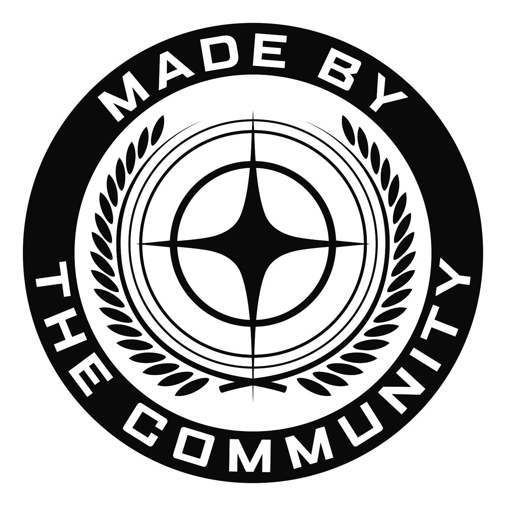

# UEX Datarunner Client

Cross-platform desktop client (Windows + Linux) for Star Citizen DataRunners. It captures commodity terminal data – **manually or via screenshot OCR** – and submits it to [UEX Corp](https://uexcorp.space). Current UEX data serves as default values and plausibility bounds for recognition.

While the game is running, a lightweight local OCR does the work. Optionally, a local AI model (via Ollama) re-checks the results once the game is closed.

> Status: **planning**. There is no runnable code yet.

## Plan

| Document | Contents |
|---|---|
| [01 – Requirements](docs/plan/01-requirements.md) | Functional and non-functional requirements, assumptions |
| [02 – Architecture](docs/plan/02-architecture.md) | Modules, data flow, domain model, platform integration, data-flow inventory |
| [03 – Language decision (ADR-0001)](docs/plan/03-language-decision.md) | Java vs. Rust, evaluation, decision: Java 27 + JavaFX 27 |
| [04 – Roadmap](docs/plan/04-roadmap.md) | Milestones M0–M5 with acceptance criteria, requirement coverage, risks |
| [05 – SC-Datarunner-UEX bug analysis](docs/plan/05-datarunner-bug-analysis.md) | Known bugs of the predecessor and our fixes |
| [06 – UEX API](docs/plan/06-uex-api.md) | Endpoints, payload, open verification points |
| [07 – OCR concept](docs/plan/07-ocr-concept.md) | Pipeline, screenshot observations, lessons from basetool-sc-extractor |
| [08 – Review](docs/plan/08-review.md) | Plan review: corrected errors, closed gaps, open points |
| [09 – Engineering principles](docs/plan/09-engineering-principles.md) | Modularisation, clean code, tests, definition of done – with enforcement |
| [10 – Supply-chain security](docs/plan/10-supply-chain-security.md) | Threat model, securing dependencies, build, CI and releases, licence gates |
| [11 – DDD and TDD](docs/plan/11-ddd-and-tdd.md) | Ubiquitous language, bounded contexts, aggregates and invariants; test-driven approach |
| [Release process](docs/release-process.md) | Versioning, release checklist, licence compliance, upgrade/downgrade, patch-day and API-change procedures |
| [ADR-0002 – Modules by bounded context](docs/adr/0002-modules-by-bounded-context.md) | Why the core is cut by bounded context and adapters by technology |
| [ADR-0003 – Licence and contributions](docs/adr/0003-licence-and-contributions.md) | GPL-3.0-or-later, DCO and CLA, the Star Citizen Fan Kit unit, notice and source duties, licence gate |
| [Open points](docs/adr/0000-open-points.md) | The single register of open owner decisions and open verifications |
| [Dependency pins](docs/dependency-pins.md) | Tags of SHA-pinned GitHub Actions; versions and checksums of CI tools |
| [Design-system prompt](docs/prompts/design-system.md) | Staged task prompt for Claude Code: design tokens, themes, state language and JavaFX CSS, inspired by the current RSI website and Spectrum (not yet run) |

## Contributing

Contributions are welcome: plan reviews, corpus captures and, later, code. Read [CONTRIBUTING.md](CONTRIBUTING.md) first. In short:

- every commit carries a DCO sign-off made with `git commit -s` and a Conventional Commits message;
- every contributor signs the [Contributor Licence Agreement](CLA.md) once; the signatures are listed in [docs/cla-signatures.md](docs/cla-signatures.md);
- pull requests are merged without squashing;
- everyone follows the [Code of Conduct](CODE_OF_CONDUCT.md).

## Security

Please report vulnerabilities privately, never in a public issue. How to do that, and what to expect, is described in [.github/SECURITY.md](.github/SECURITY.md).

## Licence

The UEX Datarunner Client is free software, licensed under the GNU General Public License, version 3 or (at your option) any later version (SPDX identifier `GPL-3.0-or-later`); see [LICENSE](LICENSE). It comes with no warranty. The decision is recorded in [ADR-0003](docs/adr/0003-licence-and-contributions.md).

- The licence covers the project's own code and documentation. Not everything in this repository is ours to license: the screenshots in [corpus/](corpus/README.md) show Star Citizen game content of Cloud Imperium, the Fan Kit logo files are Cloud Imperium's artwork, and the Code of Conduct is under CC-BY-SA-4.0. [REUSE.toml](REUSE.toml) gives the licence of every file, and [LICENSES/](LICENSES/) holds the licence texts.
- [NOTICE](NOTICE) lists every third-party component that the planned installers ship, with its licence and source, and the material that keeps its own licence. Every release will ship the licence texts and notices and attach the source archives that the bundled copyleft components require.

## Open points

Decisions and checks that are still open are tracked in [docs/adr/0000-open-points.md](docs/adr/0000-open-points.md). Among them:

- the final project and package name (O-8);
- the acceptance date of the Fankit Agreement (O-26), and which logo variant goes on light and on dark backgrounds (O-27; this README follows basetool's mapping until the project owner has checked the kit);
- whether Cloud Imperium's terms allow the game screenshots in this public repository (O-28);
- a legal review of the Microsoft C/C++ runtime in the Windows packages before the first release (O-12);
- how ONNX Runtime's built-in telemetry is switched off reliably (O-13; an M0 measurement decides);
- the WiX version for the Windows installer (O-11), and the JDK vendor whose exact source archives are attached to releases (O-25).

## Star Citizen fan content

  <picture>
    <source media="(prefers-color-scheme: dark)" srcset="docs/images/fankit/MadeByTheCommunity_White.png">
    
  </picture>

Star Citizen®, Roberts Space Industries® and Cloud Imperium ® are registered trademarks of Cloud Imperium Rights LLC

This site is not endorsed by or affiliated with the Cloud Imperium or Roberts Space Industries group of companies. All game content and materials are copyright Cloud Imperium Rights LLC and Cloud Imperium Rights Ltd.. Star Citizen®, Squadron 42®, Roberts Space Industries®, and Cloud Imperium® are registered trademarks of Cloud Imperium Rights LLC. All rights reserved.

The logo, the trademark line of the Fan Kit Guidelines §2b and the notice of the Fankit Agreement clause 2(g) above form one unit and are reproduced verbatim ([CONTRIBUTING.md](CONTRIBUTING.md)). The logo files are Cloud Imperium's artwork, used under the Fankit Agreement; they are not covered by this project's licence (`LicenseRef-Fankit-Agreement` in [REUSE.toml](REUSE.toml)).

## Disclaimer

Unofficial community project, not affiliated with UEX Corp or Cloud Imperium Games / Roberts Space Industries.
