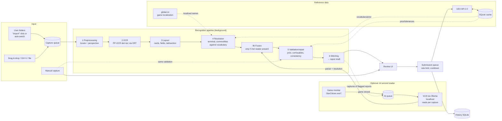

# System architecture

## 1. Overview



Guiding principles:

1. **UEX data is a constraint, not decoration.** Every recognition is resolved against the closed vocabulary (terminals, commodities, status levels, container sizes). Free OCR strings never reach the API.
2. **Guess nothing silently.** Every uncertainty becomes visible as a warning with a reason code. The submission gate blocks anything unresolved.
3. **Pure domain logic and I/O are separated.** Pipeline stages are pure functions on immutable records. This makes them testable with golden data, without UI and without network.
4. **Language-neutral cut.** The module boundaries allow individual parts (e.g. the OCR core) to be replaced later.

## 2. Modules (Gradle multi-project, JPMS modules) – bounded contexts + ports & adapters

The cut combines **DDD bounded contexts** with **ports & adapters** (decision and trade-offs: [ADR-002](../adr/0002-modules-by-bounded-context.md)):

- **Core** = one module per bounded context ([11 §A2](11-ddd-and-tdd.md)), plus `shared-kernel` and `workflows`.
  - Each context module contains its domain model **and** its application services (use cases).
  - The core knows no technology: no JavaFX, no AWT/ImageIO, no HTTP, no SQL, no ONNX, no file system (`java.nio.file`), no clock except via `java.time.Clock`.
  - Images enter the core as an own immutable raster type (`ImageRaster`: width, height, ARGB `int[]`), file locations as a value object (`FolderLocation`). Decoding (ImageIO), encoding (JPEG/PNG for the upload) and file-system access happen only in adapters.
- **Adapters** are cut by **technology** and implement the **ports** of the context modules. Inside an adapter there is one package per context.
- **`ui`** uses only the public application API of the context modules and `workflows`.
- **`app`** is exclusively composition root and packaging.

Detailed rules and their enforcement are in [09-engineering-principles.md](09-engineering-principles.md).

```
uex-datarunner-client/
├── build-logic/            Convention plugins (toolchain, Error Prone/NullAway, Spotless, tests, JaCoCo, ArchUnit, PIT)
│
│   ── Core: bounded contexts (pure) ──
├── shared-kernel/          IDs, money/quantity value objects, Outcome, domain-event base, DDD marker annotations
├── game/                   Game Environment: environment, version, game state, localization mapping model; port GameStateProbe
├── reference-data/         Reference Data: ReferenceSnapshot, vocabulary indexes, fuzzy matcher; port ReferenceDataSource
├── capture/                Capture: Capture, WatchedFolder, import use cases; ports CaptureSource, CaptureRepository
├── recognition/            Recognition: locate, layout, parse, resolve, fuse, validate, stitch, confidence; ports Reader, TextDetector
├── reporting/              Reporting: Report aggregate (I1–I5), submission gate, deviation assessment, grouping, review use cases; port ReportRepository
├── submission/             Submission: SubmissionJob, Cooldown, queue use cases; ports SubmissionGateway, SubmissionJobRepository, CooldownRepository
├── workflows/              Process managers across contexts: capture→recognition→reporting, reporting→submission, AI re-read (RecognitionPolicy, AI queue)
│
│   ── Adapters (by technology, one package per context inside) ──
├── adapter-uex/            UEX HTTP client, DTO mapping (anti-corruption layer), envelope, error codes, rate limiter, host fallback
├── adapter-storage/        SQLite: connection, migrations, repositories for all contexts, reference-data cache
├── adapter-ocr/            ONNX Runtime, DB detection, CTC recognition → implements Reader, TextDetector
├── adapter-vlm/            Optional: Ollama client, prompt resources, answer parser → implements Reader
├── adapter-files/          Folder register scan, auto-watcher, stable-file gate, clipboard; game files (global.ini, user.cfg, RSI launcher log)
├── adapter-platform/       OS integration: secret store (FFM), game process monitor, paths, truststore
│
│   ── Presentation & startup ──
├── ui/                     JavaFX (MVVM): views, ViewModels, resources/CSS/messages – talks only to application APIs and workflows
├── app/                    main(), composition root (wiring), load configuration, jlink/jpackage
└── tools/ocr-eval/         CLI: golden corpus evaluation, crop dumps, digest
```

**Context map / dependencies** (only in arrow direction, **cycle-free**, enforced by Gradle + JPMS + ArchUnit):

```
shared-kernel  ← every module
game           → shared-kernel
reference-data → shared-kernel
capture        → game
recognition    → reference-data, game
reporting      → recognition (published language: Scan, CardReading), reference-data, game
submission     → reference-data, game                 (does NOT know reporting)
workflows      → capture, recognition, reporting, submission, reference-data, game
ui             → workflows + public application API of the context modules
adapter-*      → the context modules whose ports they implement   (adapters are leaves)
app            → all                                  (wires; contains no logic)
tools/ocr-eval → recognition, adapter-ocr, adapter-vlm, adapter-storage, reference-data
```

- Each context module exports only its `api` package: application services, commands, read models, events and ports. The domain model stays in `internal`.
- `submission` never references `reporting`. `workflows` converts a released `Report` into a `SubmissionRequest` (a `submission` type) and applies `ReportSubmitted`/`SubmissionRejected` back to the report. This keeps the context map acyclic.

**Ports** (excerpt, each defined in the context module that owns it):

| Port | Context | Purpose | Implemented in |
|---|---|---|---|
| `Reader` | recognition | read panel → `ReaderResult` | adapter-ocr, adapter-vlm |
| `TextDetector` | recognition | coarse OCR for locate anchors | adapter-ocr |
| `ReferenceDataSource` | reference-data | provide current `ReferenceSnapshot`, trigger refresh | adapter-uex (fetch) + adapter-storage (cache) |
| `SubmissionGateway` | submission | send to UEX, withdraw, query status | adapter-uex |
| `CaptureSource` | capture | captures from folders, drag & drop, clipboard | adapter-files |
| `CaptureRepository` / `ReportRepository` / `SubmissionJobRepository`, `CooldownRepository` | capture / reporting / submission | persistence (one repository per aggregate) | adapter-storage |
| `GameLocalizationSource` | game | localized names from `global.ini` | adapter-files |
| `CaptureSettingsStore`, `RecognitionSettingsStore`, `ReportingSettingsStore` | capture / workflows / reporting | user settings (folders, AI mode, thresholds, hosts) in the versioned config file (R-NF-5) | adapter-files |
| `ImageEncoder` | reporting | encode the composed, redacted upload screenshot | adapter-files |
| `UpdateCheck` | workflows | "new version available" (R-NF-7, notify only) | adapter-platform |
| `SecretStore` | submission | store/read secret key | adapter-platform |
| `GameStateProbe` | game | is Star Citizen running? | adapter-platform |
| `java.time.Clock` | all | time (cooldown, hysteresis, grouping) | JDK, fixed in tests |

**Why this split?**

- Bounded-context boundaries are enforced by the compiler (JPMS), not only by ArchUnit.
- Everything about one context, model and use cases, is in one module.
- A change stays local: an SC UI patch touches `recognition` and `adapter-ocr`; a UEX API change touches `adapter-uex`.
- Use cases are **testable without JavaFX, network and database**, using fakes of the ports.
- A technology change (OCR model, secret store, UI) affects exactly one adapter.
- The disadvantages (more modules, explicit translation between contexts, more expensive re-cuts, shared-kernel growth) and their handling are documented in ADR-002.

Package root: `space.uexdatarunner.<module>` (placeholder – project name and reverse domain are to be determined by the project owner).

## 3. Domain model (excerpt, context modules)

```java
public enum GameEnvironment { LIVE, PTU, EPTU, HOTFIX, TECH_PREVIEW }

public enum TradeSide { BUY, SELL }                 // Buy tab / "Local Market Value" tab

public record TerminalId(int value) {}
public record CommodityId(int value) {}

/** UEX status level; valid codes and names come from commodities_status (ReferenceSnapshot), not from constants. */
public record InventoryStatus(int code) {
    public InventoryStatus { if (code < 1) throw new IllegalArgumentException("status " + code); }
}
// Check against the loaded levels: ReferenceSnapshot.statusLevels(side).contains(code)

/** Immutable state of the UEX reference data for one pipeline run. */
public record ReferenceSnapshot(Instant fetchedAt, Map<CommodityId, Commodity> commodities,
                                Map<TerminalId, Terminal> terminals, StatusLevels statusLevels,
                                DataParameters parameters, Map<TerminalId, List<PricePrior>> priors) {}

/** A field value with its origin and assessment – core of the "guess nothing silently" principle. */
@ValueObject
public record Field<T>(@Nullable T value, FieldAssessment assessment, List<Finding> findings,
                       @Nullable Region source, @Nullable Confirmation confirmation) {}

public sealed interface Finding permits Finding.Ambiguous, Finding.OutOfTolerance,
        Finding.Repaired, Finding.Inconsistent, Finding.Unreadable, Finding.PartialCard { … }

@ValueObject
public record ReportRow(CommodityId commodity, Field<PricePerScu> price, Field<ScuQuantity> scu,
                        Field<InventoryStatus> status, Field<ContainerSizes> containerSizes,
                        int screenOrder) {}

/** Aggregate root (context Reporting). Immutable: commands return a new state plus events. */
@AggregateRoot
public record Report(ReportId id, long version, Field<TerminalId> terminal, TradeSide side, GameEnvironment env,
                     GameVersion versionAtCapture, List<ReportRow> rows, List<CaptureId> captures,
                     ReportState state) {   // version: optimistic concurrency (user edit vs. AI re-read)
    public Outcome<Report> confirm(CommodityId commodity, FieldKind field) { … }
    public Outcome<Report> correct(CommodityId commodity, FieldKind field, Object newValue) { … } // revokes confirmation (I3)
    public Outcome<Report> release(SubmissionGate gate) { … }                                  // checks I1, I2, I5
}

public sealed interface ReportState permits Draft, Released, Queued, Submitted, Rejected, Withdrawn {}
/** Result of a command: new state + domain events, or domain error (no exception). */
public sealed interface Outcome<T> permits Outcome.Ok, Outcome.Refused {}
```

The domain model (Bounded Contexts, aggregates, invariants I1–I5, events, Ubiquitous Language) is in [11-ddd-and-tdd.md](11-ddd-and-tdd.md). This section only shows its form in code.

- **Money:** `BigDecimal`, never `double`. Since SC 4.7 the game shows whole aUEC; the API accepts float.
- **Pattern matching:** Pipeline results are `sealed` (`ScanResult.Located | NotLocated | WrongScreen`) and are evaluated with `switch` and record patterns.

## 4. Recognition pipeline (`recognition`, readers in `adapter-ocr`)

Details and derivation are in [07-ocr-concept.md](07-ocr-concept.md). Short version:

Locate needs a coarse OCR for the text anchors. So that `recognition` does not depend on `adapter-ocr`, the port `TextDetector` (in `recognition`) is injected into it for this purpose.

| Stage | Input → output | Key techniques |
|---|---|---|
| 1 Locate | `ImageRaster` → panel quad(s) | Box-filter downscale; color and luminance anchors (theme-agnostic); text anchors from a coarse OCR pass ("SHOP INVENTORY", "YOUR INVENTORIES"); homography to normalized size; manual fallback |
| 2 OCR | Normalized image → `List<TextBox>` (polygon, text, score) | PP-OCRv6 small det (DBNet) + rec (CTC) via ONNX Runtime 1.30.0, full dictionary |
| 3 Layout | TextBoxes → `List<Card>` + header | Cards via borders/spacing and the label "AVAILABLE CARGO SIZE"; field assignment relative to the card; tab recognition via color intensity of the tab background |
| 4 Resolution | Cards → commodity/terminal candidates | Normalization (upper/lower case, whitespace, ligatures) plus weighted Levenshtein/Jaro-Winkler against the vocabulary, terminal's assortment preferred |
| 5 Validation | Candidates → `Field<T>` with findings | Number parser, UEX prior, `data_parameters` tolerances, confusable repair, glyph topology veto, status↔SCU consistency |
| 6 Stitching | Scans → `Report` (state `Draft`) | Grouping by terminal, side and time window; merge via `CommodityId` (simpler than in basetool thanks to resolution); edge card rule; conflict ⇒ `Ambiguous` |

## 4a. Image input (`capture`, technology in `adapter-files`)

```java
public record WatchedFolder(FolderLocation location, boolean enabled, ImportMode mode, boolean recursive,
                            Set<String> extensions, EnvironmentChoice environment,
                            @Nullable Instant onlyNewerThan) {}
public enum ImportMode { MANUAL, AUTOMATIC }
```

- **Working copies** (R-CAP-7): After locate, the normalized panel crops are stored in the app data directory; all later steps (review, VLM, upload) work on them.
- The types above live in `capture`; **`FolderScanner`, `FolderWatcher` and `StableFileGate` live in `adapter-files`** (they touch the file system) and deliver new files through the `CaptureSource` port.
- **`FolderScanner`**: It lists the candidates (`Files.walk` or `Files.list`, extension filter), matches them against the **processed-file register** (path, size and mtime as a fast key, content hash as identity) and returns the new files. It is used by the "Import" button and the catch-up scan.
- **`FolderWatcher`** per folder in mode `AUTOMATIC`:
  - `WatchService` on a virtual thread; on `OVERFLOW` a full scan follows.
  - If registration fails or the file system is known to be unreliable (Wine/FUSE/SMB paths, can be forced via setting), polling is used instead (`FolderScanner` every 2 s).
- **`StableFileGate`**: waits until size and mtime are stable for a quiet period and `ImageIO` decodes the file; then hands it over to the capture queue.
- Settings are applied live: if a folder switches between MANUAL and AUTOMATIC, the watcher starts or stops without restarting the app.

## 4b. Optional AI recognition (`adapter-vlm`, `adapter-platform`, control in `workflows`)

- **Reader abstraction** (in `recognition`):

  ```java
  public enum ReaderKind { OCR, VLM }
  /** Deliberately NOT sealed: implementations live in other JPMS modules (adapter-ocr, adapter-vlm),
   *  and sealed types in named modules only allow subtypes in the same module. */
  public interface Reader { ReaderResult read(NormalizedPanel panel) throws ReaderException; }
  public record ReaderResult(ReaderKind kind, List<RawCard> cards, @Nullable RawHeader header, Duration took) {}
  ```

  The classic OCR and the VLM deliver the same raw structure. **Order:**

  1. Parsing and resolution (stage 4) run **per reader**.
  2. Then follows the **fusion** per field into candidates (rules in [07](07-ocr-concept.md) §2.7).
  3. Validation, repair and confidence (stage 5) run **once** on the fused result.
  4. Finally, stitching (stage 6) follows.

  The VLM reads per capture; after an AI run, the affected report is re-stitched. Only reports in state `Draft` are touched (R-VLM-4); the write uses the report's `version` (optimistic concurrency), so a concurrent user edit wins and the AI result is re-applied on top of the edited state (never on confirmed fields).

- **`GameProcessMonitor`** (`adapter-platform`, implements `GameStateProbe`):
  - Periodically checks `ProcessHandle.allProcesses()` on a virtual thread (Windows: path `…\Bin64\StarCitizen.exe`; Linux: Wine/Proton command line, assumption A7).
  - Publishes the states `RUNNING` and `CLOSED` with hysteresis through the `GameStateProbe` port (listener callback → `GameStateChanged` event). The `ui` maps the event to a JavaFX property; no JavaFX types outside `ui`.
  - Has no further permissions and no process access.

- **`RecognitionPolicy`** (`workflows`) decides, based on the setting (Off / Automatic / Always) and the game state, whether the AI queue may work:

  | Setting | Game running | Game closed |
  |---|---|---|
  | Off | OCR only | OCR only |
  | Automatic | OCR only; reports are flagged for the AI | AI queue runs (only reports with warnings or all) |
  | Always | OCR + AI (warning) | OCR + AI |

- **AI queue** (`workflows`, persistence via `adapter-storage`):
  - One job per capture, one after the other (the VLM uses the GPU exclusively), persisted in SQLite as "AI pending".
  - While a job is running, the game monitor checks at a 2 s interval instead of a 5 s interval.
  - On switching to `RUNNING`: abort the running request (`HttpClient` future `cancel`), unload the model (`keep_alive: 0`), jobs back into the queue.
  - When the queue is empty: unload the model after a short time (default `keep_alive` 5 min).

- **`OllamaClient`** (`adapter-vlm`): `java.net.http` and Jackson; endpoints `/api/version`, `/api/tags`, `/api/ps`, `/api/pull` (streaming progress) and `/api/chat` (`stream: false`, `images` as Base64, `options.temperature = 0`). Host allowlist: localhost; other hosts only after confirmation (R-VLM-6).

## 5. Reference data (`reference-data`, fetching in `adapter-uex`, cache in `adapter-storage`)

- The endpoints and TTLs are in [06-uex-api.md](06-uex-api.md). At startup, data is loaded from the cache (immediately usable), then refreshed in the background.
- **In-memory indexes:**
  - Commodity names (EN, localized, code)
  - Terminal names, nicknames and display names
  - Location names
  - Assortment per terminal
  - Status levels per side
- The **price prior** is loaded on demand when a terminal is opened or recognized (`commodities_prices?id_terminal=`) and cached (30 min).
- **Persistence:** SQLite (`sqlite-jdbc`), tables `ref_*` with raw JSON and extracted index columns; schema migrations versioned (simple custom migration script, no ORM).

## 6. Submission (`reporting` gate, `submission` queue, HTTP in `adapter-uex`, persistence in `adapter-storage`)

- **Responsibilities:**
  - `reporting`: submission gate, grouping (a report is released only if the gate passes).
  - `submission` (`SubmissionService`): queue states, cooldown, **retry policy** (when and how often to retry), rate budgets (120 requests/min, 1000 report rows/30 min).
  - `workflows`: hands released reports to `submission` and applies the results back to `reporting`.
  - `adapter-uex` (`UexSubmissionGateway`): JSON payload, HTTP, **one attempt per call** (no own retries), surfaces `Retry-After`, error code mapping to `submission` error types.
  - `adapter-storage`: persistence.
- **Payload building** (in `adapter-uex`): one list `prices[]` per report. Buy rows contain `price_buy`/`scu_buy`/`status_buy`, sell rows the `_sell` fields. In addition there are `container_sizes` and `screenshot` (Base64 without `data:` prefix), `game_version` and `is_production`.
- **Queue:**
  - persistent in SQLite (states: queued → sent / failed / discarded); after a restart only after release by the user
  - virtual threads
  - `Semaphore` (default 2)
  - token bucket 120/min
  - retry with exponential backoff on 429/5xx/IO, respecting `Retry-After` (decided in `submission`, executed by calling the gateway again)
- **Cooldown:** the key is (terminal, commodity, environment) – conservatively without side until assumption A12 is clarified; persistent; the UI shows the remaining time. If `duplicated_report` arrives anyway, it is treated as a cooldown, not as an error.
- **Screenshot per report:** `recognition` provides the normalized shop-panel rasters; `reporting` composes them vertically and redacts the balance region (pure raster operations, tested); `ImageEncoder` (adapter-files) encodes JPEG/PNG < 10 MB (R-SUB-7).
- **History:** `ids_reports`, timestamp, payload hash, response status; link `https://uexcorp.space/data/info/id/<id>`.

## 7. UI (`ui`, JavaFX 27)

- **MVVM:** views in Java code or FXML (passive, no logic); ViewModels with JavaFX properties call only the application APIs of the context modules and `workflows`; dependencies via constructor (no DI framework). ViewModels are unit-testable without a started window.
- **Threading:** pipeline and network run in an `ExecutorService` on virtual threads. UI updates happen exclusively via `Platform.runLater`. CPU-heavy OCR runs in a **bounded** platform thread pool (default: `max(1, min(2, cores / 2))`), so that the game is not slowed down.
- **Views:**
  1. Input/queue
  2. Report editor (table plus screenshot pane with highlight of the source region)
  3. Manual capture
  4. History
  5. Settings (folders, environments, key, game localization file, test mode, thresholds)
  6. Onboarding wizard
  7. Diagnostics
- **Theming:** own CSS (dark/light), independent of the OS. The colors for recognition confidence and deviation are theme variables (palette suitable for color vision deficiency, replaceable in the theme).
- **Deviation marking** (R-UI-10..12):
  - `reporting` computes a `FieldAssessment(confidence, deviation, reference, referenceAge, delta)` per field. The function is pure and property-tested.
  - The ViewModel only maps this to CSS pseudo-classes (`:deviation-minor`, `:deviation-major`, `:no-reference`, `:needs-confirmation`).
  - The view contains no comparison logic; this guarantees the same assessment in OCR and manual capture.

## 8. Platform integration

| Topic | Windows | Linux |
|---|---|---|
| Secret store | Credential Manager (`CredWriteW`/`CredReadW`) via **FFM API** | Secret Service (libsecret) via FFM; fallback file 0600 after warning |
| Truststore | `Windows-ROOT` (SunMSCAPI) in addition to the JDK truststore | System CA via JDK default |
| Paths | `%APPDATA%\<App>` (config), `%LOCALAPPDATA%\<App>` (cache/DB/logs) | XDG directories |
| SC detection | RSI Launcher log, process, drive default paths | Wine/Proton prefixes (configurable; default candidates see assumption A3) |
| Package | MSI (jpackage + WiX), ZIP | `.deb` (jpackage), `tar.gz` (app image) |

## 9. Security and privacy

- Secret key only in the OS keystore; masking in logs via a Logback filter. A test ensures that the key never appears in a log line.
- Upload screenshot: only the shop crop, balance redacted (see F30).
- No telemetry. Network targets are exclusively UEX, GitHub Releases (update check, can be disabled) and – optionally – the local Ollama instance.
- No access to the game process except reading the process list (path and game detection).
- Only panel crops are passed to the VLM, never the whole screenshot (balance).

## 10. Build and CI

- Gradle 9.8.1 (Kotlin DSL, version catalog `gradle/libs.versions.toml`, convention plugins in `build-logic`), Java toolchain 27 via Foojay resolver.
- GitHub Actions, matrix `windows-latest` and `ubuntu-latest`:
  - `./gradlew check` (Spotless, Error Prone/NullAway, tests)
  - OCR eval on the public (redacted) corpus
  - `jpackage` per OS on tags
- Releases: artifacts plus SHA-256 checksums, CycloneDX SBOM and signed build provenance.
- **Supply chain:** dependency locking, dependency verification (SHA-256 + PGP), wrapper validation, SHA-pinned actions – see [10-supply-chain-security.md](10-supply-chain-security.md).
