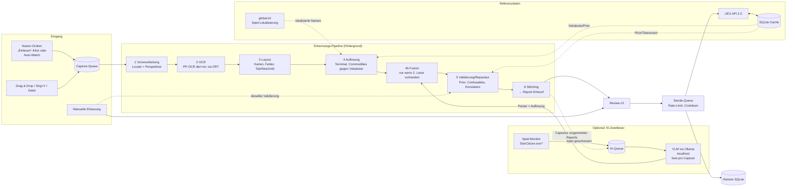

# Systemarchitektur

## 1. Überblick



Leitprinzipien:

1. **UEX-Daten sind Constraint, nicht Dekoration.** Jede Erkennung wird gegen das geschlossene Vokabular (Terminals, Commodities, Statusstufen, Container-Größen) aufgelöst. Freie OCR-Strings erreichen nie die API.
2. **Nichts still raten.** Jede Unsicherheit wird als Warnung mit Grund-Code sichtbar. Das Sende-Gate blockiert Ungeklärtes.
3. **Reine Domänenlogik und I/O sind getrennt.** Pipeline-Stufen sind reine Funktionen auf unveränderlichen Records. Dadurch sind sie mit Golden-Daten testbar, ohne UI und ohne Netzwerk.
4. **Sprachneutraler Schnitt.** Die Modulgrenzen erlauben, einzelne Teile (z. B. den OCR-Kern) später auszutauschen.

## 2. Module (Gradle-Multiprojekt, JPMS-Module) – Ports & Adapters

Der Schnitt folgt **Ports & Adapters** (hexagonale Architektur):

- **Kern** (`domain`, `pipeline`, `application`): enthält die Fachlogik und kennt keine Technik (kein JavaFX, kein HTTP, kein SQL, kein Dateisystem, keine Uhr außer über `java.time.Clock`).
- **Adapter** implementieren die **Ports** (Interfaces in `domain`).
- **`ui`** nutzt nur die Use-Cases aus `application`.
- **`app`** ist ausschließlich Composition Root und Packaging.

Detaillierte Regeln und ihre Durchsetzung stehen in [09-engineering-prinzipien.md](09-engineering-prinzipien.md).

```
uex-datarunner-client/
├── build-logic/            Convention-Plugins (Toolchain, Error Prone/NullAway, Spotless, Tests, JaCoCo, ArchUnit)
│
│   ── Kern ──
├── domain/                 Entities/Value Objects (Records, sealed Types), Ports (Interfaces), Fehlertypen; nur JSpecify
├── pipeline/               Erkennungslogik als reine Funktionen: Locate, Layout, Parser, Auflösung, Fusion, Validierung, Stitching, Konfidenz
├── application/            Use-Cases und Workflows: Einlesen, Verarbeiten, Gruppieren, Review, Senden (Queue, Cooldown, Sendeschwelle), KI-Queue + RecognitionPolicy, Einstellungen
│
│   ── Adapter (implementieren Ports) ──
├── adapter-uex/            UEX-HTTP-Client, DTOs + Mapping auf domain, Envelope, Fehlercodes, Rate-Limiter, Host-Fallback
├── adapter-refdata/        Referenzdaten-Cache, Refresh, Vokabular-Indizes, Fuzzy-Matcher, global.ini-Parser → `ReferenceSnapshot`
├── adapter-ocr/            ONNX Runtime, DB-Detektion, CTC-Erkennung → implementiert `Reader`, `TextDetector`
├── adapter-vlm/            Optional: Ollama-Client, Prompt-Ressourcen, Antwort-Parser → implementiert `Reader`
├── adapter-capture/        Ordner-Register, Einlese-Scan, Auto-Watcher, Stable-File-Gate, Clipboard → implementiert `CaptureSource`
├── adapter-storage/        SQLite: Verbindung, Migrationen, Repositories (Captures, Reports, Queue, Historie, Cache)
├── adapter-platform/       OS-Integration: Secret-Store (FFM), Spiel-Prozess-Monitor, SC-Installationserkennung, Pfade, Truststore
│
│   ── Präsentation & Start ──
├── ui/                     JavaFX (MVVM): Views, ViewModels, Ressourcen/CSS/i18n – spricht nur mit application
├── app/                    main(), Composition Root (Verdrahtung), Konfiguration laden, jlink/jpackage
└── tools/ocr-eval/         CLI: Golden-Korpus-Auswertung, Crop-Dumps, Digest
```

Abhängigkeiten (nur in Pfeilrichtung, **zyklenfrei**):

```
pipeline      → domain
application   → pipeline, domain
ui            → application, domain
adapter-*     → domain                (implementieren Ports)
adapter-refdata → adapter-uex, adapter-storage   (einzige erlaubte Adapter→Adapter-Kanten)
adapter-capture, adapter-vlm → adapter-storage    (nur wenn eigene Tabellen nötig; sonst über Ports)
app           → alle                  (verdrahtet; enthält keine Logik)
tools/ocr-eval → pipeline, adapter-ocr, adapter-vlm, adapter-refdata
```

**Ports** (Auszug, in `domain`):

| Port | Zweck | Implementiert in |
|---|---|---|
| `Reader` | Panel lesen → `ReaderResult` | adapter-ocr, adapter-vlm |
| `TextDetector` | Grob-OCR für Locate-Anker | adapter-ocr |
| `ReferenceDataSource` | aktuellen `ReferenceSnapshot` liefern, Refresh anstoßen | adapter-refdata |
| `SubmissionGateway` | Report an UEX senden, zurückziehen, Status abfragen | adapter-uex |
| `CaptureSource` | Captures aus Ordnern, Drag & Drop, Zwischenablage | adapter-capture |
| `CaptureRepository`, `ReportRepository`, `SubmissionQueueRepository`, `HistoryRepository` | Persistenz | adapter-storage |
| `SecretStore` | Secret-Key ablegen/lesen | adapter-platform |
| `GameStateProbe` | läuft Star Citizen? | adapter-platform |
| `java.time.Clock` | Zeit (Cooldown, Hysterese, Gruppierung) | JDK, in Tests fest |

**Warum diese Aufteilung?** (Gegenüber der ersten Fassung, in der `app` UI, Secret-Store und KI-Steuerung vereinte und `submission`/`capture` Fachlogik mit Technik mischten.)

- Use-Cases (`application`) sind **ohne JavaFX, Netz und Datenbank testbar** – mit Fakes der Ports.
- Technikwechsel (z. B. anderes OCR-Modell, anderer Secret-Store, später ein anderes UI) betrifft genau ein Modul.
- Jedes Modul hat eine Aufgabe; `app` bleibt klein und frei von Logik.

Package-Root: `space.uexdatarunner.<modul>` (Platzhalter – Projektname und Reverse-Domain sind vom Projektinhaber festzulegen).

## 3. Domänenmodell (Auszug, `domain`)

```java
public enum GameEnvironment { LIVE, PTU, EPTU, HOTFIX, TECH_PREVIEW }

public enum TradeSide { BUY, SELL }                 // Buy-Tab / "Local Market Value"-Tab

public record TerminalId(int value) {}
public record CommodityId(int value) {}

/** UEX-Statusstufe; gültige Codes und Namen kommen aus commodities_status (ReferenceSnapshot), nicht aus Konstanten. */
public record InventoryStatus(int code) {
    public InventoryStatus { if (code < 1) throw new IllegalArgumentException("status " + code); }
}
// Prüfung gegen die geladenen Stufen: ReferenceSnapshot.statusLevels(side).contains(code)

/** Unveränderlicher Stand der UEX-Referenzdaten für einen Pipeline-Lauf. */
public record ReferenceSnapshot(Instant fetchedAt, Map<CommodityId, Commodity> commodities,
                                Map<TerminalId, Terminal> terminals, StatusLevels statusLevels,
                                DataParameters parameters, Map<TerminalId, List<PricePrior>> priors) {}

/** Ein Feldwert samt Herkunft und Bewertung – Kern des "nichts still raten"-Prinzips. */
@ValueObject
public record Field<T>(@Nullable T value, FieldAssessment assessment, List<Finding> findings,
                       @Nullable Region source, @Nullable Confirmation confirmation) {}

public sealed interface Finding permits Finding.Ambiguous, Finding.OutOfTolerance,
        Finding.Repaired, Finding.Inconsistent, Finding.Unreadable, Finding.PartialCard { … }

@ValueObject
public record ReportRow(CommodityId commodity, Field<PricePerScu> price, Field<ScuQuantity> scu,
                        Field<InventoryStatus> status, Field<ContainerSizes> containerSizes,
                        int screenOrder) {}

/** Aggregate Root (Kontext Meldung). Unveränderlich: Befehle liefern einen neuen Zustand plus Events. */
@AggregateRoot
public record Report(ReportId id, Field<TerminalId> terminal, TradeSide side, GameEnvironment env,
                     GameVersion versionAtCapture, List<ReportRow> rows, List<CaptureId> captures,
                     ReportState state) {
    public Outcome<Report> confirm(CommodityId commodity, FieldKind field) { … }
    public Outcome<Report> correct(CommodityId commodity, FieldKind field, Object newValue) { … } // hebt Bestätigung auf (I3)
    public Outcome<Report> release(SubmissionGate gate) { … }                                  // prüft I1, I2, I5
}

public sealed interface ReportState permits Draft, Released, Queued, Submitted, Rejected, Withdrawn {}
/** Ergebnis eines Befehls: neuer Zustand + Domain-Events, oder fachlicher Fehler (keine Exception). */
public sealed interface Outcome<T> permits Outcome.Ok, Outcome.Refused {}
```

Das fachliche Modell (Bounded Contexts, Aggregate, Invarianten I1–I5, Events, Ubiquitous Language) steht in [11-ddd-und-tdd.md](11-ddd-und-tdd.md). Dieser Abschnitt zeigt nur die Form im Code.

- **Geld:** `BigDecimal`, nie `double`. Seit SC 4.7 zeigt das Spiel ganze aUEC; die API akzeptiert float.
- **Pattern Matching:** Pipeline-Ergebnisse sind `sealed` (`ScanResult.Located | NotLocated | WrongScreen`) und werden mit `switch` und Record-Patterns ausgewertet.

## 4. Erkennungs-Pipeline (`pipeline`, Leser in `adapter-ocr`)

Details und Herleitung stehen in [07-ocr-konzept.md](07-ocr-konzept.md). Kurzfassung:

Locate braucht für die Text-Anker eine Grob-OCR. Damit `pipeline` nicht von `adapter-ocr` abhängt, bekommt sie dafür den Port `TextDetector` (in `domain`) injiziert.

| Stufe | Eingabe → Ausgabe | Wichtigste Techniken |
|---|---|---|
| 1 Locate | `BufferedImage` → Panel-Quad(s) | Box-Filter-Downscale; Farb- und Luminanzanker (theme-agnostisch); Text-Anker aus einem Grob-OCR-Pass („SHOP INVENTORY“, „YOUR INVENTORIES“); Homographie auf Normgröße; manueller Fallback |
| 2 OCR | Normbild → `List<TextBox>` (Polygon, Text, Score) | PP-OCRv6 small det (DBNet) + rec (CTC) via ONNX Runtime 1.30.0, volles Wörterbuch |
| 3 Layout | TextBoxen → `List<Card>` + Header | Karten über Rahmen/Abstände und das Label „AVAILABLE CARGO SIZE“; Feldzuordnung relativ zur Karte; Tab-Erkennung über Farbintensität des Tab-Hintergrunds |
| 4 Auflösung | Karten → Commodity-/Terminal-Kandidaten | Normalisierung (Groß-/Kleinschreibung, Leerzeichen, Ligaturen) plus gewichtetes Levenshtein/Jaro-Winkler gegen das Vokabular, Sortiment des Terminals bevorzugt |
| 5 Validierung | Kandidaten → `Field<T>` mit Findings | Zahlparser, UEX-Prior, `data_parameters`-Toleranzen, Confusable-Reparatur, Glyph-Topologie-Veto, Status↔SCU-Konsistenz |
| 6 Stitching | Scans → `Report` (Zustand `Draft`) | Gruppierung nach Terminal, Seite und Zeitfenster; Merge über `CommodityId` (dank Auflösung einfacher als in basetool); Randkarten-Regel; Konflikt ⇒ `Ambiguous` |

## 4a. Bildeingang (`adapter-capture`, Steuerung in `application`)

```java
public record WatchedFolder(Path path, boolean enabled, ImportMode mode, boolean recursive,
                            Set<String> extensions, EnvironmentChoice environment,
                            @Nullable Instant onlyNewerThan) {}
public enum ImportMode { MANUAL, AUTOMATIC }
```

- **Arbeitskopien** (R-CAP-7): Nach dem Locate werden die normalisierten Panel-Ausschnitte im App-Datenverzeichnis abgelegt; alle späteren Schritte (Review, VLM, Upload) arbeiten darauf.
- **`FolderScanner`** (rein bis auf das Dateisystem-Listing): Er listet die Kandidaten (`Files.walk` bzw. `Files.list`, Endungsfilter), gleicht sie gegen das **Verarbeitet-Register** ab (Pfad, Größe und mtime als schneller Schlüssel, Inhalts-Hash als Identität) und liefert die neuen Dateien. Ihn nutzen der Button „Einlesen“ und der Nachhol-Scan.
- **`FolderWatcher`** pro Ordner im Modus `AUTOMATIC`:
  - `WatchService` auf einem Virtual Thread; bei `OVERFLOW` folgt ein Voll-Scan.
  - Scheitert die Registrierung oder ist das Dateisystem bekannt unzuverlässig (Wine-/FUSE-/SMB-Pfade, per Einstellung erzwingbar), wird stattdessen gepollt (`FolderScanner` alle 2 s).
- **`StableFileGate`**: wartet, bis Größe und mtime eine Ruhezeit lang stabil sind und `ImageIO` die Datei dekodiert; danach Übergabe an die Capture-Queue.
- Einstellungen werden live übernommen: Wechselt ein Ordner zwischen MANUAL und AUTOMATIC, startet bzw. stoppt der Watcher ohne Neustart der App.

## 4b. Optionale KI-Erkennung (`adapter-vlm`, `adapter-platform`, Steuerung in `application`)

- **Leser-Abstraktion** (in `domain`):

  ```java
  public enum ReaderKind { OCR, VLM }
  /** Bewusst NICHT sealed: Implementierungen liegen in anderen JPMS-Modulen (ocr, vlm),
   *  und sealed-Typen in benannten Modulen erlauben nur Subtypen im selben Modul. */
  public interface Reader { ReaderResult read(NormalizedPanel panel) throws ReaderException; }
  public record ReaderResult(ReaderKind kind, List<RawCard> cards, @Nullable RawHeader header, Duration took) {}
  ```

  Die klassische OCR und das VLM liefern dieselbe Rohstruktur. **Reihenfolge:**

  1. Parsen und Auflösen (Stufe 4) läuft **pro Leser**.
  2. Danach folgt die **Fusion** pro Feld zu Kandidaten (Regeln in [07](07-ocr-konzept.md) §2.7).
  3. Validierung, Reparatur und Konfidenz (Stufe 5) laufen **einmal** auf dem fusionierten Ergebnis.
  4. Zum Schluss folgt das Stitching (Stufe 6).

  Das VLM liest pro Capture; nach einem KI-Lauf wird der betroffene Report neu gestitcht.

- **`GameProcessMonitor`** (`adapter-platform`, implementiert `GameStateProbe`):
  - Prüft periodisch auf einem Virtual Thread `ProcessHandle.allProcesses()` (Windows: Pfad `…\Bin64\StarCitizen.exe`; Linux: Wine-/Proton-Kommandozeile, Annahme A7).
  - Veröffentlicht die Zustände `RUNNING` und `CLOSED` mit Hysterese als JavaFX-Property bzw. Listener.
  - Hat keine weiteren Rechte und keinen Prozesszugriff.

- **`RecognitionPolicy`** (`application`) entscheidet anhand der Einstellung (Aus / Automatisch / Immer) und des Spielzustands, ob die KI-Queue arbeiten darf:

  | Einstellung | Spiel läuft | Spiel geschlossen |
  |---|---|---|
  | Aus | nur OCR | nur OCR |
  | Automatisch | nur OCR; Reports werden für die KI vorgemerkt | KI-Queue läuft (nur Reports mit Warnungen oder alle) |
  | Immer | OCR + KI (Warnung) | OCR + KI |

- **KI-Queue** (`application`, Persistenz über `adapter-storage`):
  - Ein Job pro Capture, einer nach dem anderen (das VLM nutzt die GPU exklusiv), persistiert in SQLite als „KI ausstehend“.
  - Während ein Job läuft, prüft der Spiel-Monitor im 2-s-Takt statt im 5-s-Takt.
  - Beim Wechsel auf `RUNNING`: laufenden Request abbrechen (`HttpClient`-Future `cancel`), Modell entladen (`keep_alive: 0`), Jobs zurück in die Queue.
  - Wenn die Queue leer ist: Modell nach kurzer Zeit entladen (Standard `keep_alive` 5 min).

- **`OllamaClient`** (`adapter-vlm`): `java.net.http` und Jackson; Endpoints `/api/version`, `/api/tags`, `/api/ps`, `/api/pull` (Streaming-Fortschritt) und `/api/chat` (`stream: false`, `images` als Base64, `options.temperature = 0`). Host-Allowlist: localhost; andere Hosts nur nach Bestätigung (R-VLM-6).

## 5. Referenzdaten (`adapter-refdata`)

- Die Endpoints und TTLs stehen in [06-uex-api.md](06-uex-api.md). Beim Start wird gecacht geladen (sofort nutzbar), dann im Hintergrund aktualisiert.
- **Indizes im Speicher:**
  - Commodity-Namen (EN, lokalisiert, Code)
  - Terminal-Namen, Nicknames und Display-Namen
  - Location-Namen
  - Sortiment pro Terminal
  - Statusstufen pro Seite
- Der **Preis-Prior** wird beim Öffnen bzw. Erkennen eines Terminals nachgeladen (`commodities_prices?id_terminal=`) und gecacht (30 min).
- **Persistenz:** SQLite (`sqlite-jdbc`), Tabellen `ref_*` mit Roh-JSON und extrahierten Indexspalten; Schema-Migrationen versioniert (einfaches eigenes Migrationsskript, kein ORM).

## 6. Übermittlung (Logik in `application`, HTTP in `adapter-uex`, Persistenz in `adapter-storage`)

- **Zuständigkeiten:**
  - `application` (`SubmissionService`): Sende-Gate, Queue-Zustände, Cooldown, Gruppierung.
  - `adapter-uex` (`UexSubmissionGateway`): JSON-Payload, HTTP, Rate-Limiter, Retry, Fehlercode-Mapping auf `domain`-Fehlertypen.
  - `adapter-storage`: Persistenz.
- **Payload-Bau** (in `adapter-uex`): pro Report eine Liste `prices[]`. Buy-Zeilen enthalten `price_buy`/`scu_buy`/`status_buy`, Sell-Zeilen die `_sell`-Felder. Dazu kommen `container_sizes` und `screenshot` (Base64 ohne `data:`-Präfix), `game_version` und `is_production`.
- **Queue:**
  - persistent in SQLite (Zustände: eingereiht → gesendet / fehlgeschlagen / verworfen); nach einem Neustart erst nach Freigabe durch den Nutzer
  - Virtual Threads
  - `Semaphore` (Standard 2)
  - Token-Bucket 120/min
  - Retry mit exponentiellem Backoff bei 429/5xx/IO, unter Beachtung von `Retry-After`
- **Cooldown:** Schlüssel ist (Terminal, Commodity, Umgebung) – konservativ ohne Seite, bis Annahme A12 geklärt ist; persistent; die UI zeigt die Restzeit. Kommt trotzdem `duplicated_report`, wird das als Cooldown behandelt, nicht als Fehler.
- **Screenshot pro Report:** Mehrere Captures werden zu einem Bild zusammengesetzt (R-SUB-7).
- **Historie:** `ids_reports`, Zeitstempel, Payload-Hash, Antwort-Status; Link `https://uexcorp.space/data/info/id/<id>`.

## 7. UI (`ui`, JavaFX 27)

- **MVVM:** Views in Java-Code oder FXML (passiv, keine Logik); ViewModels mit JavaFX-Properties rufen nur Use-Cases aus `application` auf; Abhängigkeiten per Konstruktor (kein DI-Framework). ViewModels sind ohne gestartetes Fenster unit-testbar.
- **Threading:** Pipeline und Netzwerk laufen in einem `ExecutorService` auf Virtual Threads. UI-Updates passieren ausschließlich über `Platform.runLater`. CPU-lastige OCR läuft in einem **begrenzten** Plattform-Thread-Pool (Standard: `max(1, min(2, cores / 2))`), damit das Spiel nicht ausgebremst wird.
- **Ansichten:**
  1. Eingang/Queue
  2. Report-Editor (Tabelle plus Screenshot-Pane mit Highlight der Quellregion)
  3. Manuelle Erfassung
  4. Historie
  5. Einstellungen (Ordner, Umgebungen, Key, Sprache, Testmodus, Schwellwerte)
  6. Onboarding-Assistent
  7. Diagnose
- **Theming:** eigenes CSS (dunkel/hell), unabhängig vom OS. Die Farben für Erkennungssicherheit und Abweichung sind Theme-Variablen (farbsehschwäche-taugliche Palette, im Theme austauschbar).
- **Abweichungsmarkierung** (R-UI-10..12):
  - `application` berechnet pro Feld ein `FieldAssessment(confidence, deviation, reference, referenceAge, delta)`. Die Funktion ist rein und property-getestet.
  - Das ViewModel bildet das nur auf CSS-Pseudoklassen ab (`:deviation-minor`, `:deviation-major`, `:no-reference`, `:needs-confirmation`).
  - Die View enthält keine Vergleichslogik; so ist dieselbe Bewertung in OCR- und manueller Erfassung garantiert.

## 8. Plattform-Integration

| Thema | Windows | Linux |
|---|---|---|
| Secret-Store | Credential Manager (`CredWriteW`/`CredReadW`) via **FFM-API** | Secret Service (libsecret) via FFM; Fallback-Datei 0600 nach Warnung |
| Truststore | `Windows-ROOT` (SunMSCAPI) zusätzlich zum JDK-Truststore | System-CA über JDK-Standard |
| Pfade | `%APPDATA%\<App>` (Config), `%LOCALAPPDATA%\<App>` (Cache/DB/Logs) | XDG-Verzeichnisse |
| SC-Erkennung | RSI-Launcher-Log, Prozess, Laufwerks-Standardpfade | Wine-/Proton-Prefixe (konfigurierbar; Standardkandidaten siehe Annahme A3) |
| Paket | MSI (jpackage + WiX), ZIP | `.deb` (jpackage), `tar.gz` (App-Image) |

## 9. Sicherheit und Datenschutz

- Secret-Key nur im OS-Keystore; Maskierung in Logs über einen Logback-Filter. Ein Test stellt sicher, dass der Key nie in einer Log-Zeile auftaucht.
- Upload-Screenshot: nur der Shop-Ausschnitt, Kontostand geschwärzt (siehe F30).
- Keine Telemetrie. Netzwerkziele sind ausschließlich UEX, GitHub Releases (Update-Check, abschaltbar) und – optional – die lokale Ollama-Instanz.
- Kein Zugriff auf den Spielprozess außer dem Lesen der Prozessliste (Pfad- und Spielerkennung).
- Dem VLM werden nur Panel-Ausschnitte übergeben, nie der ganze Screenshot (Kontostand).

## 10. Build und CI

- Gradle 9.8.1 (Kotlin DSL, Version-Catalog `gradle/libs.versions.toml`, Convention-Plugins in `build-logic`), Java-Toolchain 27 via Foojay-Resolver.
- GitHub Actions, Matrix `windows-latest` und `ubuntu-latest`:
  - `./gradlew check` (Spotless, Error Prone/NullAway, Tests)
  - OCR-Eval auf dem öffentlichen (geschwärzten) Korpus
  - `jpackage` pro OS bei Tags
- Releases: Artefakte plus SHA-256-Prüfsummen, CycloneDX-SBOM und signierte Build-Provenienz.
- **Lieferkette:** Dependency-Locking, Dependency-Verification (SHA-256 + PGP), Wrapper-Validierung, SHA-gepinnte Actions – siehe [10-supply-chain-security.md](10-supply-chain-security.md).
