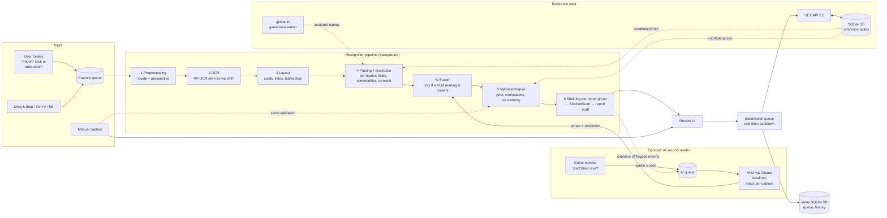

# System architecture

> **Doc type:** Living spec — binding. Last reviewed: 2026-10-09.

## 1. Overview



Guiding principles:

1. **UEX data is a constraint, not decoration.** Every recognition is resolved against the closed vocabulary (terminals, commodities, status levels, container sizes). Free OCR strings never reach the API.
2. **Guess nothing silently.** Every uncertainty becomes visible as a warning with a reason code. The submission gate blocks anything unresolved.
3. **Pure domain logic and I/O are separated.** Pipeline stages are pure functions on immutable records. This makes them testable with golden data, without UI and without network.
4. **Language-neutral cut.** The module boundaries allow individual parts (e.g. the OCR core) to be replaced later.

## 2. Modules (Gradle multi-project, JPMS modules) – bounded contexts + ports & adapters

The cut combines **DDD bounded contexts** with **ports & adapters** (decision and trade-offs: [ADR-002](../adr/0002-modules-by-bounded-context.md)):

- **Core** = one module per bounded context ([11 §A2](11-ddd-and-tdd.md)), plus `shared-kernel` and `workflows`.
  - Each context module contains its domain model **and** its application services (use cases).
  - The core knows no technology: no JavaFX, no AWT/ImageIO, no HTTP or sockets, no SQL, no ONNX, no file system (`java.nio.file`, `java.io` file streams), no processes or native access (FFM), no clock except via `java.time.Clock` (enforcement in 09 §2).
  - Images enter the core as an own immutable raster type (`ImageRaster`: width, height, ARGB `int[]`), file locations as a value object (`FolderLocation`); both live in `shared-kernel`. Decoding (ImageIO), encoding (JPEG/PNG for the upload) and file-system access happen only in adapters.
- **Adapters** are cut by **technology** and implement the **ports** of the context modules. Inside an adapter there is one package per context.
- **`ui`** uses only the public application API of the context modules and `workflows`.
- **`app`** is exclusively composition root and packaging.

Detailed rules and their enforcement are in [09-engineering-principles.md](09-engineering-principles.md).

```
uex-datarunner-client/
├── build-logic/            Convention plugins (toolchain, Error Prone/NullAway, Spotless, tests, JaCoCo, ArchUnit, PIT)
│
│   ── Core: bounded contexts (pure) ──
├── shared-kernel/          IDs, money/quantity value objects, ImageRaster, FolderLocation, Outcome, domain-event base, LogContext scoped-value key, DDD marker annotations
├── game/                   Game Environment: environment, version (incl. observed version history per UEX environment, R-CAP-3b), game state with the running channel, localisation mapping model, Game.log witness facts (R-OCR-20); ports GameStateProbe, GameLocalizationSource, GameObservationRepository, GameLogSource
├── reference-data/         Reference Data: ReferenceSnapshot per environment, vocabulary indexes, fuzzy matcher, refresh/TTL logic; ports ReferenceDataFetcher, ReferenceDataCache
├── capture/                Capture: Capture, WatchedFolder, import use cases; ports CaptureSource, CaptureImageLoader, CaptureRepository
├── recognition/            Recognition: ImageRaster ops, locate, layout, parse, resolve, fuse, validate, stitch (→ StitchedScan, application service StitchingService), confidence; ports Reader, TextDetector, ScanRepository
├── reporting/              Reporting: Report aggregate (I1–I7), submission gate, deviation assessment, grouping (scans → report groups), Report building (StitchedScan → Report), upload composition, review use cases; ports ReportRepository, ImageEncoder
├── submission/             Submission: SubmissionJob, Cooldown, queue use cases; ports SubmissionGateway, SubmissionJobRepository, CooldownRepository
├── workflows/              Process managers across contexts: capture→recognition→reporting, reporting→submission, AI re-read (RecognitionPolicy, AI queue); event dispatch from the transactional outbox (11 §A6); ports AiJobRepository, EventOutbox, WorkingCopyStore, UpdateCheck
│
│   ── Adapters (by technology, one package per context inside) ──
├── adapter-uex/            UEX HTTP client, DTO mapping (anti-corruption layer), envelope, error codes, rate limiter, host fallback
├── adapter-storage/        SQLite: connection, migrations, repositories for all contexts, reference-data cache
├── adapter-ocr/            ONNX Runtime, DB detection, CTC recognition → implements Reader, TextDetector
├── adapter-vlm/            Optional: Ollama client, prompt resources, answer parser → implements Reader
├── adapter-files/          Folder scan/watch, stable-file gate, clipboard, image decoding/encoding (ImageIO); game files (global.ini, user.cfg, RSI launcher log, Game.log read-only for R-OCR-20); config file (ConfigFile and all *SettingsStore), WorkingCopyStore
├── adapter-platform/       OS integration: secret store (FFM), game process monitor, paths, truststore, worker thread priority (FFM), clipboard change detection (FFM)
│
│   ── Presentation & startup ──
├── ui/                     JavaFX (MVVM): views, ViewModels, resources/CSS/messages – talks only to application APIs and workflows
├── app/                    main(), composition root (wiring), bootstrap (data directory, portable marker), jlink/jpackage
└── tools/ocr-eval/         CLI: golden corpus evaluation, crop dumps, digest
```

**Context map / dependencies** (only in arrow direction, **cycle-free**, enforced by Gradle + JPMS + ArchUnit):

```
shared-kernel  ← every module
game           → shared-kernel
reference-data → shared-kernel
capture        → game
recognition    → reference-data, game
reporting      → recognition (published language: Scan, CardReading, StitchedScan, FieldReading, Finding), reference-data, game
submission     → reference-data, game                 (does NOT know reporting)
workflows      → capture, recognition, reporting, submission, reference-data, game
ui             → workflows + public application API of the context modules
adapter-*      → the context modules whose ports they implement   (adapters are leaves)
app            → all                                  (wires; contains no logic)
tools/ocr-eval → recognition, reference-data, adapter-ocr, adapter-vlm, adapter-files, adapter-uex   (a second composition root – the only other module allowed to depend on adapters; adapter-uex only replays the corpus' recorded reference data, never HTTP, 07 §4)
```

- Each context module exports exactly two packages: `…<context>.api` (application services, commands, read models, events, ports) and `…<context>.api.model` (aggregates and value objects that ports and other contexts must name, e.g. `Report` for `ReportRepository`). Domain services, policies and helpers stay in `internal`. (An earlier version hid the whole model in `internal`; then adapters could not implement repository ports – they cannot name non-exported types.)
- **Protecting aggregates that are exported:** the compact constructor of an aggregate record validates all state-local invariants (e.g. I1); ArchUnit allows calls of the canonical constructor only from the aggregate itself and from the persistence mapper in `adapter-storage` (reconstitution). Transitions (I3, I4, I7) are only possible through the command methods (I7: `applyScan`; the merge use case applies the same rule).
- `submission` never references `reporting`. `workflows` converts a released `Report` into a `SubmissionRequest`. This is a `submission` type; it also carries `observedAt`, the age confirmation, the report's game version together with the newest version its R-CAP-3b choice was confirmed against, if any (I5), and the row keys that the send-time checks need. `workflows` applies the submission events back to the report as state changes: `SubmissionDeferred`, `SubmissionSucceeded`, `SubmissionPartiallyAccepted`, `SubmissionOutcomeUnknown`, `SubmissionRejected`, `SubmissionReturned`, `SubmissionCancelled`, `WithdrawalSucceeded`, `WithdrawalFailed` (both per row), `UexReportStatusChanged`, all published by `submission` (mapping in §6). This keeps the context map acyclic.

**Ports** (excerpt, each defined in the context module that owns it):

| Port | Context | Purpose | Implemented in |
|---|---|---|---|
| `Reader` | recognition | read panel → `ReaderResult` | adapter-ocr, adapter-vlm |
| `TextDetector` | recognition | coarse OCR for locate anchors | adapter-ocr |
| `ReferenceDataFetcher` | reference-data | fetch raw reference data from UEX | adapter-uex |
| `ReferenceDataCache` | reference-data | persist/load cached reference data with fetch time | adapter-storage |
| `SubmissionGateway` | submission | send to UEX, withdraw, query status | adapter-uex |
| `CaptureSource` | capture | captures from folders and clipboard monitoring; drag & drop and Ctrl+V arrive as JavaFX events in `ui`, which passes file paths or image bytes to the capture application API | adapter-files (clipboard change detection: adapter-platform) |
| `CaptureImageLoader` | capture | decode a Capture's file into an `ImageRaster` when its OCR job starts (R-CAP-8 decoding, pixel budget R-OCR-17) | adapter-files |
| `CaptureRepository` / `ScanRepository` / `ReportRepository` / `SubmissionJobRepository`, `CooldownRepository` / `GameObservationRepository` | capture / recognition / reporting / submission / game | persistence (one repository per aggregate); `save(newState, expectedVersion, events)` writes state and outbox rows in one transaction (11 §A6); `ScanRepository` keeps the scans for re-stitching and AI fusion; `GameObservationRepository` holds the observed version history per UEX environment and the observed running channels | adapter-storage |
| `GameLocalizationSource` | game | localised names from `global.ini` | adapter-files |
| `GameLogSource` | game | witness facts from `Game.log` (kiosk location, assortment, container sizes per commodity, game version) with their log time, parsed by the format validated for the game version; player handle and ID are dropped while parsing (R-OCR-20, A24) | adapter-files |
| `CaptureSettingsStore`, `GameSettingsStore`, `ReportingSettingsStore`, `RecognitionSettingsStore`, `AppSettingsStore` | capture / game / reporting / workflows / workflows | user settings per the settings catalogue below, in the versioned config file (R-NF-5) | adapter-files |
| `ImageEncoder` | reporting | encode the composed, redacted upload screenshot | adapter-files |
| `WorkingCopyStore` | workflows | save/load/delete the redacted, perspective-corrected panel crops per `CaptureId` and panel kind (lossless, about 1:1 source scale, R-CAP-7) and the user-selected attachment region per `ReportId` (R-MAN-5) | adapter-files |
| `UpdateCheck` | workflows | "new version available" (R-NF-7, notify only) | adapter-platform |
| `AiJobRepository`, `EventOutbox` | workflows | AI queue persistence; `EventOutbox`: read pending outbox entries, mark them delivered, after-commit notification (11 §A6) | adapter-storage |
| `SecretStore` | submission | store/read the secret key and the user's app token (R-NF-4, O-85) | adapter-platform |
| `GameStateProbe` | game | is Star Citizen running, and from which channel folder? | adapter-platform |
| `java.time.Clock` | all | time (cooldown, hysteresis, grouping) | JDK, fixed in tests |

**Settings catalogue** (user-editable settings; the defaults are defined in the cited requirement):

| Setting | Owner, port | Applies |
|---|---|---|
| Watched folders: mode, environment rule, subfolders, file types, "only newer than" (R-CAP-1…1e); clipboard monitoring on/off (R-CAP-2) | capture, `CaptureSettingsStore` | live (§4a) |
| Environment mapping to UEX (R-CAP-3a); SC installation path, Wine/Proton prefixes and localisation file (R-CAP-4, R-L10N-2, §8); Game.log witness on/off (R-OCR-20, default off) | game, `GameSettingsStore` | live; a mapping change applies to reports released afterwards |
| Send threshold (07 §2.6), staleness limit (R-UI-11; default from UEX `commodity.ttl`, fallback 15 days), `maxObservationAge` (R-VAL-6), grouping window (R-OCR-13), session gap (R-UI-14), tolerance overrides (effective tolerance, R-VAL-2), test mode (R-SUB-8) | reporting, `ReportingSettingsStore` | at the next assessment or release; test mode only for reports released afterwards (R-SUB-8) |
| AI mode and re-check scope (R-VLM-1, R-VLM-4), Ollama host and its non-loopback/remote-model consent (R-VLM-6), AI model choice (R-VLM-7; compared with the evaluated-model list, S-27), digit threshold (07 §2.6), per-source notice count and "Don't show again" per source (R-OCR-18) | workflows, `RecognitionSettingsStore` | new captures and the next AI job; a non-loopback Ollama host or a remote model only after the consent is recorded |
| UEX base host: a built-in UEX-confirmed host or a confirmed expert custom host (R-API-3; the fallback list is built in, not a setting), update check on/off (R-NF-7), retention per category (R-CAP-7), theme and text size (R-UI-7, R-UI-17) | workflows, `AppSettingsStore` | hosts: new requests only, never an in-flight POST or an `OutcomeUnknown` job (R-SUB-9); retention: next cleanup; theme and text size: live |

Safety thresholds can only be made stricter (R-NF-5): the send threshold, the digit threshold and the staleness limit can only be raised, tolerance overrides can only tighten, and `maxObservationAge` can only be lowered. Release-calibrated values are not user-editable (the same list as R-NF-5 and 09 §3): the confidence ladder (07 §2.6), the R-OCR-17 text-size limits (confirm limit and lower limit), the R-OCR-18 tone thresholds and the R-VAL-6 hard limit. The only exception is the session-only lift of the R-OCR-19 cap, which is never persisted (R-NF-5). The loader replaces an unparsable or out-of-range value with its default, reports it visibly and never uses it (R-NF-5). These release-calibrated values and the other thresholds that are not user-editable (queue parallelism, backoff, rate budgets, hysteresis, polling intervals, the R-OCR-17 pixel budget, which bounds memory per R-NF-3, and the §9 header-check limits) live in the owning module's typed settings record with documented defaults, not in the config file. The `*Wiring` classes in `app` read the stores and pass values to the adapters that need them (`adapter-uex`, `adapter-vlm`, `adapter-files`, `adapter-platform`) as a `Supplier<…>` backed by the store, so a change applies to the next request without a restart. All `*SettingsStore` implementations in `adapter-files` share one `ConfigFile` component. It is the single writer (serialised read-modify-write, temp file plus `ATOMIC_MOVE`, F17), owns the one schema version and migration ([release-process.md](../release-process.md)) and gives each store its own section.

**Why this split?**

- Bounded-context boundaries are enforced by the compiler (JPMS), not only by ArchUnit.
- Everything about one context, model and use cases, is in one module.
- A change stays local: an SC UI patch touches `recognition` and `adapter-ocr`; a UEX API change touches `adapter-uex`.
- Use cases are **testable without JavaFX, network and database**, using fakes of the ports.
- A technology change (OCR model, secret store, UI) affects exactly one adapter.
- The disadvantages (more modules, explicit translation between contexts, more expensive re-cuts, shared-kernel growth) and their handling are documented in ADR-002.

Package root: `space.uexdatarunner.<module>` (placeholder – project name and reverse domain are to be determined by the project owner).

## 3. Domain model (excerpt, context modules)

```java
public enum GameEnvironment { LIVE, PTU, EPTU, HOTFIX, TECH_PREVIEW }

public enum TradeSide { BUY, SELL }                 // Buy tab / "Local Market Value" tab
public enum SubmissionMode { TEST, PRODUCTION }    // is_production, fixed at release (R-SUB-8); shared-kernel (used by reporting and submission)

public record TerminalId(int value) {}
public record CommodityId(int value) {}

/** UEX status level; valid codes and names come from commodities_status (ReferenceSnapshot), not from constants. */
public record InventoryStatus(int code) {
    public InventoryStatus { if (code < 1) throw new IllegalArgumentException("status " + code); }
}
// Check against the loaded levels: ReferenceSnapshot.statusLevels(side).contains(code)

/** Immutable state of the UEX reference data of one mapped UEX environment for one pipeline run (R-API-6); Commodity carries the commodity-wide average price used as the R-VAL-2a substitute. */
public record ReferenceSnapshot(Instant fetchedAt, Map<CommodityId, Commodity> commodities,
                                Map<TerminalId, Terminal> terminals, StatusLevels statusLevels,
                                DataParameters parameters, Map<TerminalId, List<PricePrior>> priors) {}

// ── recognition.api.model ──
/** What Recognition read for one field; the rows of a StitchedScan carry these. */
public record FieldReading<T>(@Nullable T value, Confidence confidence, List<Finding> findings,
                              @Nullable Region source) {}

public sealed interface Finding permits Finding.Ambiguous, Finding.OutOfTolerance, Finding.NoReference,
        Finding.Repaired, Finding.Inconsistent, Finding.Unreadable, Finding.PartialCard,
        Finding.Superseded, Finding.UnvalidatedGameVersion, Finding.LowContrastCapture, Finding.ClippedHighlights,
        Finding.SmallText, Finding.TextTooSmall, Finding.LocationAssortmentMismatch, Finding.UnexpectedCommodity,
        Finding.SectionUnknown, Finding.UnevaluatedModel, Finding.Downscaled { … }   // Downscaled is info only

// ── reporting.api.model ──
public enum FieldOrigin { RECOGNIZED, USER }   // RECOGNIZED: from a reader (OCR, VLM or fused); USER: typed, corrected or taken over by keystroke
public enum ConfidenceLevel { OK, CONFIRM, SELECT, CORRECT }  // R-UI-4; derived from the cause (07 §2.6)

/** Computed by DeviationAssessor (pure), recomputed at release (R-VAL-7); confidence is null for USER values. */
public record FieldAssessment(@Nullable Confidence confidence, ConfidenceLevel level, Deviation deviation,
                              boolean referenceOutdated, @Nullable PricePrior reference,
                              @Nullable Duration referenceAge, @Nullable Delta delta) {}

/** A field value with its origin and assessment – core of the "guess nothing silently" principle. */
@ValueObject
public record Field<T>(@Nullable T value, FieldOrigin origin, List<Finding> findings, @Nullable Region source,
                       FieldAssessment assessment, @Nullable Confirmation<T> confirmation) {}

/** User approval of exactly one value, with the unlowered deviation level it was given against (R-VAL-7). */
@ValueObject
public record Confirmation<T>(T value, Deviation deviationAtConfirmation) {}

/** A row of a Report: observed on screen, or marked missing by the user (R-VAL-5). Same module, so sealed is allowed. */
public sealed interface ReportRow permits ObservedRow, MissingRow { RowId id(); }

@ValueObject
public record ObservedRow(RowId id, Field<CommodityId> commodity,   // unresolved: candidates in Finding.Ambiguous
                          Field<PricePerScu> price, Field<ScuQuantity> scu,
                          Field<InventoryStatus> status, Field<ContainerSizes> containerSizes,
                          int screenOrder) implements ReportRow {}

/** No values and no screen order; created only by Report.markMissing, which is the explicit user decision (R-VAL-5). */
@ValueObject
public record MissingRow(RowId id, CommodityId commodity) implements ReportRow {}

/** R-CAP-3b classes; game context (published language), decided by GameVersionHistory. */
public enum VersionCertainty { CERTAIN, PROVISIONAL, UNCERTAIN, UNKNOWN }

/** Game version at capture time (R-CAP-3b, I5); version is null only for UNKNOWN; the user's choice is bound to (version, newest observed version). */
public record VersionAtCapture(@Nullable GameVersion version, VersionCertainty certainty, @Nullable GameVersion confirmedAgainst) {}

/** R-VAL-6: bound to observedAt; valid for maxObservationAge after it was given. */
public record AgeConfirmation(Instant observedAt, Instant givenAt) {}

/** R-CAP-10 (manual reports, from M4): the Report's environment confirmed against this running channel, at givenAt.
 *  Report-level and value-bound (I3): it counts only for the same running channel; changeEnvironment revokes it. */
public record EnvironmentConfirmation(GameEnvironment runningChannel, Instant givenAt) {}

/** Release inputs from outside reporting, filled by the workflows release use case (§6); AccountStanding and
 *  ScreenshotPolicy are reporting's own enums (no reporting → submission dependency).
 *  runningChannel: the environment of the running game's channel from game's API; null if the game is closed or the
 *  channel is unknown, which never counts as a mismatch (R-CAP-10). */
public record ReleaseContext(AccountStanding account, ScreenshotPolicy screenshotPolicy,
                             @Nullable GameEnvironment runningChannel) {}

/** User-selected upload region of a manual report (R-MAN-5, R-SUB-7); a new image replaces it, so the preview confirmation is bound to the hash. */
public record ManualAttachment(ImageHash image, boolean previewConfirmed) {}

/** Report-level findings (capture time, observation age, return reasons). Owned by reporting: a sealed type only
 *  allows subtypes in its own module, and recognition's Finding stays free of reporting and submission concepts. */
public sealed interface ReportFinding permits ReportFinding.CaptureTimeUncertain, ReportFinding.ObservationAgeUnconfirmed,
        ReportFinding.ObservationTooOld, ReportFinding.NewerObservationSent, ReportFinding.GameVersionChanged,
        ReportFinding.PossiblyAlreadyReceived, ReportFinding.ReturnedForFix { … }   // ReturnedForFix(FixableReason)
public enum FixableReason { SCREENSHOT_REQUIRED, SCREENSHOT_TOO_LARGE, TOO_MANY_ROWS, TERMINAL_NOT_FOUND, DATE_REJECTED, RESTART }   // invalid_game_version is permanent (R-SUB-11)

/** Per-row result of a withdrawal (R-SUB-4, O-89); a Report may hold a mix of them. */
public sealed interface RowWithdrawal permits RowWithdrawal.Withdrawn, RowWithdrawal.Failed, RowWithdrawal.AlreadyConsolidated {}

/** Aggregate root (context Reporting). Immutable: commands return a new state plus events. */
@AggregateRoot
public record Report(ReportId id, long version, Field<TerminalId> terminal, Field<TradeSide> side, GameEnvironment env,
                     @Nullable EnvironmentConfirmation environmentConfirmation,
                     Instant observedAt, @Nullable AgeConfirmation ageConfirmation, SubmissionMode mode,
                     VersionAtCapture versionAtCapture, @Nullable ManualAttachment attachment,
                     @Nullable FactionAffinity factionAffinity,
                     List<ReportRow> rows, Map<RowId, RowWithdrawal> withdrawals, Coverage coverage, List<CaptureId> captures,
                     List<ReportFinding> findings, ReportState state) {
    // factionAffinity: R-SUB-13, user-entered only (−100..100); never inferred
    // withdrawals: per-row withdrawal results of a submitted Report (R-SUB-4, I4)
    // version: optimistic concurrency (user edit vs. AI re-read)
    // observedAt: oldest capture time; manual reports at most the Draft creation time; only ever moved earlier (R-VAL-6)
    // coverage: per-section coverage from the StitchedScan (R-VAL-5); findings: report-level findings (capture time, age, return reasons)
    // environmentConfirmation: R-CAP-10 confirmation of a manual report (default, owner question; rule below the code)
    public Outcome<Report> confirm(RowId row, FieldKind field) { … }
    public Outcome<Report> correct(RowId row, FieldKind field, Object newValue) { … } // revokes confirmation, sets origin USER (I3)
    public Outcome<Report> applyScan(StitchedScan scan) { … }               // a new capture joins this Draft; never changes USER or confirmed fields (I7)
    public Outcome<Report> selectCommodity(RowId row, CommodityId commodity) { … }
    public Outcome<Report> excludeRow(RowId row) { … }
    public Outcome<Report> markMissing(CommodityId commodity) { … }          // R-VAL-5 preconditions; unmarkMissing reverses it
    public Outcome<Report> selectTerminal(TerminalId terminal) { … }         // key change
    public Outcome<Report> changeSide(TradeSide side) { … }                  // key change
    public Outcome<Report> changeEnvironment(GameEnvironment env, VersionAtCapture versionInThatEnvironment) { … }  // key change; revokes the EnvironmentConfirmation
    public Outcome<Report> confirmEnvironment(GameEnvironment runningChannel, Instant now) { … }  // R-CAP-10, manual reports: sets EnvironmentConfirmation(runningChannel, now)
    public Outcome<Report> confirmGameVersion(GameVersion current) { … }     // I5
    public Outcome<Report> correctGameVersion(GameVersion chosen) { … }      // R-CAP-3b: chosen from the version history
    public Outcome<Report> reclassifyVersion(VersionAtCapture reclassified) { … }  // after a successful game_versions fetch (§5): PROVISIONAL → CERTAIN or UNCERTAIN
    public Outcome<Report> correctObservedAt(Instant earlierOrSame, VersionAtCapture versionAtThatTime) { … }
        // confirms an uncertain time; revokes the age confirmation; workflows derives the version valid at that time from GameVersionHistory (R-CAP-3b)
    public Outcome<Report> confirmObservationAge(Instant now) { … }          // R-VAL-6, I6
    public Outcome<Report> confirmAttachmentPreview(ImageHash image) { … }   // R-SUB-7
    public Outcome<Report> release(SubmissionGate gate) { … }                // checks I1, I2, I5, I6
    public Outcome<Report> returnToDraft(ReportFinding reason) { … }         // job returned (§6)
    public Outcome<Report> cancel() { … }                                    // Released → Draft; Queued/WaitingForCooldown → Draft only after SubmissionCancelled(USER) (§6)
    public Outcome<Report> discard(DiscardReason reason) { … }               // Draft only, by the user only
    public Outcome<ReportSplit> splitOffCooldownRows(Set<RowId> rows) { … }  // "send the others now" (R-SUB-4); after SubmissionCancelled(SPLIT) (§6)
    public Outcome<List<Report>> splitByContainerSizes() { … }               // at release: one Released Report per distinct sent container-size set (R-OCR-9, O-92)
    public Outcome<Report> setFactionAffinity(@Nullable FactionAffinity value) { … }  // R-SUB-13, Draft only
    public Outcome<Report> applyWithdrawal(RowId row, RowWithdrawal result) { … }     // I4: per row; Withdrawn once every accepted row is withdrawn
    public Outcome<Report> duplicateAsDraft(ReportId newId) { … }            // I4
}

public sealed interface ReportState permits Draft, Released, Queued, WaitingForCooldown, Submitted,
        PartiallyAccepted, OutcomeUnknown, Rejected, Withdrawn, Discarded {}
public record Discarded(DiscardReason reason) implements ReportState {}   // terminal; reached only by the user

/** SubmissionGate.evaluate(report): side-effect free; the gate is built per release attempt with the snapshot, settings,
 *  now and the ReleaseContext (11 §A5); also used by "release all ready" (R-UI-14). */
public sealed interface GateVerdict permits GateVerdict.Ready, GateVerdict.Blocked {}  // Blocked(List<BlockReason>)
public sealed interface BlockReason permits TerminalUnresolved, SideUnresolved, CommodityUnresolved,
        FieldsBelowThreshold, MajorDeviationUnconfirmed, DeviationWorsened, EnvironmentUnmapped,
        EnvironmentUnconfirmed, GameVersionUnknown, GameVersionUnconfirmed, CaptureTimeUnconfirmed,
        ObservationAgeUnconfirmed, ObservationTooOld, NewerObservationSent, ScreenshotMissing, PreviewUnconfirmed,
        AccountNotReady {}   // closed acceptance is a warning, not a block reason (I2, R-SUB-5)
// EnvironmentUnconfirmed(GameEnvironment runningChannel): R-CAP-10 mismatch without a confirmation for that channel

// ── shared-kernel ──
/** Result of a command: new state + domain events, or domain error (no exception). */
public sealed interface Outcome<T> permits Outcome.Ok, Outcome.Refused {}
```

The domain model (Bounded Contexts, aggregates, invariants I1–I7, events, Ubiquitous Language) is in [11-ddd-and-tdd.md](11-ddd-and-tdd.md). This section only shows its form in code.

- **Money:** `BigDecimal`, never `double`. Since SC 4.7 the game shows whole aUEC; the API accepts float.
- **`ImageRaster`** is a final class (not a record): defensive copy of the `int[]` on construction, no raw-array accessor, explicit `equals`/`hashCode` over the pixels. It is the one documented exemption from the "domain model classes are records" rule. It lives in `shared-kernel`, because `capture`, `recognition` and `reporting` all use it.
- **Decoding is not recognition:** format detection by magic bytes, colour conversion to sRGB and the decode-time reduction above the pixel budget (R-CAP-8, R-OCR-17) happen in `adapter-files` while decoding; together with upload encoding they are the only pixel operations outside the core. HDR-encoded files never become an `ImageRaster` (they are set aside).
- **Pattern matching:** Pipeline results are `sealed` (`ScanResult.Located | NotLocated | WrongScreen`; decision rule in 07 §2.1 item 3) and are evaluated with `switch` and record patterns.
- **Report-level and row commands** are allowed only in `Draft`; in any other state they return `Outcome.Refused`. The exceptions are the lifecycle commands `release`, `splitByContainerSizes` (in `Released`, before the job is created), `returnToDraft`, `cancel`, `splitOffCooldownRows` (in `WaitingForCooldown`), `applyWithdrawal` and `duplicateAsDraft`, and the transitions that apply submission events (§6 table) or the user's `OutcomeUnknown` resolution (11 §A3).
- **Key change** (terminal, side or environment = the grouping key, R-OCR-13): the aggregate records the new key, drops the confirmations of rows whose commodity changes and emits `ReportKeyChanged`. For an environment change, `workflows` passes the version valid at the capture time in that environment's history (R-CAP-3b). `workflows` then re-runs recognition stages 4–6 on the report's stored scans with the chosen terminal fixed and the reference data of the chosen side and environment (R-API-6); for a manual report only validation and deviation are re-run. Other rows keep their confirmations under the R-VAL-7 rule (kept unless the deviation level gets worse). If a Draft with the same key exists within the grouping window, the app offers a merge (R-OCR-13, R-UI-14) and never merges silently; duplicate commodities are resolved by the stitching rule (07 §2.5b) and shown to the user.
- **Return from submission:** `workflows` maps `SubmissionReturned(reason)` to a `ReportFinding` and calls `returnToDraft`. A report-fixable `SubmissionError` of `submission` (R-SUB-11) becomes `ReturnedForFix(FixableReason)`, so no UEX code enters `reporting`; a version change at the send attempt becomes `GameVersionChanged`, and the report is "to be checked" (I5).
- **Report-level findings** (`ReportFinding`): `CaptureTimeUncertain` comes from the capture-time rule (R-CAP-5) and is resolved by `correctObservedAt`; while it is open, stitching and grouping do not decide by capture time (R-OCR-11, R-OCR-13), and `workflows` passes that uncertainty with the scans. The other findings record why a job came back (§6).
- **Environment confirmation** (R-CAP-10, manual reports, from M4; default, an owner question in [08](08-review.md)): the confirmation is report-level state of the Report (`EnvironmentConfirmation`: the running channel it was given against and the time), not a `ReportFinding`. The gate takes the running channel from `ReleaseContext.runningChannel`. If that channel maps (R-CAP-3a, the same mapping as for `EnvironmentUnmapped`) to another UEX environment than the Report's `env`, and the Report has no `EnvironmentConfirmation` for that channel, `evaluate` returns `Blocked` with `EnvironmentUnconfirmed(runningChannel)` (I2). `confirmEnvironment(runningChannel, now)` records it; a different running channel at a later release attempt needs a new confirmation, and `changeEnvironment` revokes it (I3). No running game, or an unknown channel, is never a mismatch. OCR reports are cross-checked at import instead (Capture state `EnvironmentPending`, §4a), so the gate does not apply this check to them.
- **Rows:** an `ObservedRow` has a stable `RowId`, assigned when the row is built from the `StitchedScan` and kept by re-stitching for the same commodity (or, for an unresolved card, the same source card); a `MissingRow` gets its `RowId` from `markMissing`. `selectCommodity` re-runs the prior-dependent steps for that row (price candidate choice and repair, 07 §2.5 item 3; deviation) through `reporting → recognition`, and drops the row's price, SCU and status confirmations (I3). If another row already has that commodity, it merges the two rows with the R-OCR-11 conflict rule (07 §2.5b) and shows the merge. Excluded rows are not sent; `ReportReleased` carries only resolved, non-excluded rows, so cooldown and job keys always have a resolved `CommodityId`.
- **Side:** `Scan`/`StitchedScan` carry the side as `FieldReading<TradeSide>` with findings (`Ambiguous`, `Inconsistent`); the Report copies it into `Field<TradeSide>` (07 §2.1 item 7).
- **Container-size split** (R-OCR-9, decided 2026-10-09, O-92): `data_submit` takes one `container_sizes` per report. The release use case in `workflows` calls `splitByContainerSizes()` on the Released Report: its sent rows are grouped by the identical container-size set they send (a set is sent only if it passes I2 itself, 11 §A1 "Mandatory field"), and rows without a sent set form one group without the field. One group keeps the Report; every other group becomes its own Released Report with disjoint rows that keeps the header, `observedAt`, captures, confirmations, age confirmation and faction affinity, like `splitOffCooldownRows`. Each Released Report is one `data_submit` with the same composed screenshot (R-SUB-7); the history links them as parts of one capture.
- **Withdrawal per row** (I4, R-SUB-4, decided 2026-10-09, O-89): `applyWithdrawal` records the row's `RowWithdrawal` result from the submission events (§6). A row may be withdrawn only while it has a verified UEX report ID and its last `data_info` answer has `is_editable` = 1. The Report state stays `Submitted` or `PartiallyAccepted` while some accepted rows are not withdrawn, and moves to `Withdrawn` when every accepted row is withdrawn.

## 4. Recognition pipeline (`recognition`, readers in `adapter-ocr`)

Details and derivation are in [07-ocr-concept.md](07-ocr-concept.md). Short version:

Locate needs a coarse OCR for the text anchors. So that `recognition` does not depend on `adapter-ocr`, the port `TextDetector` (in `recognition`) is injected into it for this purpose.

| Stage | Input → output | Key techniques |
|---|---|---|
| 1 Locate | `ImageRaster` → panel quad(s), text-size and tone assessment | Box-filter downscale (factor ≤ 1, native-resolution retry, tiling for very wide frames; 07 §2.1 item 1); text anchors from a coarse OCR pass ("SHOP INVENTORY", "YOUR INVENTORIES"); luma-gradient frame edges with relative thresholds (no theme colour); homography to a working size set by the reference glyph height; text-size gate (R-OCR-17); per-panel tone analysis and normalisation (R-OCR-18); manual fallback |
| 2 OCR | Normalised image → `List<TextBox>` (polygon, text, line score, and per character the probability and the x-span of the CTC frames that emitted it) | PP-OCRv6 small det (DBNet) + rec (CTC) via ONNX Runtime 1.30.0, full dictionary |
| 3 Layout | TextBoxes → `List<Card>` + header | Cards via borders/spacing and the label "AVAILABLE CARGO SIZE"; card completeness from geometry (07 §2.3); field roles by position and suffix, relative to the card (07 §2.3); section headers and side text read only inside the shop panel, section per card (07 §2.3); tab recognition by comparing the tab fills (relative luminance and saturation) with the shop-panel text as witness – disagreement gives side `Inconsistent`, both abstaining gives `Ambiguous` (07 §2.1 item 7) |
| 4 Parsing + resolution (per reader) | Cards → parsed field candidates (price/SCU as `BigDecimal` candidates incl. currency-prefix and confusable variants at uncertain positions, status, cargo sizes) + commodity and terminal candidates | Field parsers per 07 §2.4 (shared number parser; unit and currency-glyph handling only for OCR tokens); normalisation (upper/lower case, whitespace, ligatures) plus weighted Levenshtein/Jaro-Winkler against the global vocabulary of the environment; terminal candidates from the location field with the assortment check per candidate; assortment pass for unexpected commodities (07 §2.5 items 1–2) |
| 4b Fusion (only if a VLM reading is present) | Per-reader candidates → fused candidates per field | Rules over the per-reader candidate sets, only for cards that Layout marked complete (07 §2.7) |
| 5 Validation (once, on the fused result) | Fused candidates → `FieldReading<T>` (value, confidence, findings, source region) | Candidate scoring with UEX prior and effective tolerances (R-VAL-2), confusable repair with the witness rule (R-VAL-2b), glyph-topology witness and veto, status↔SCU and other consistency rules, confidence (07 §2.5, §2.6) |
| 6 Stitching | Scans of one report group → `StitchedScan` (a `recognition` type whose rows carry `FieldReading`s) | **Grouping comes first:** `ReportGrouper` (`reporting`) assigns each scan to a report group from its grouping data (resolved or unresolved terminal, side, environment, capture time; R-OCR-13). `workflows` builds that data from the capture and its scan, because `reporting` does not depend on `capture`. `workflows` then loads the group's scans (`ScanRepository`), calls `StitchingService.stitch(List<Scan>)` and hands the `StitchedScan` to `reporting`, which creates or updates the Draft (optimistic `version` check; fields with origin `USER` or a confirmation are never replaced, I7). Merge via `CommodityId` (simpler than in basetool thanks to resolution); edge card rule; conflicting readings per 07 §2.5b item 5 (`Ambiguous`, or `Superseded` at confirm). The `StitchedScan` also carries the per-section coverage (expanded, gap-free) that R-VAL-5 needs; `reporting` keeps it as the Report's `Coverage`. Re-stitch triggers: a capture joins a Draft, a scan's terminal is resolved later (regrouping), a user split or merge, a key change (§3), an AI fusion that stored a new scan. |

## 4a. Image input (`capture`, technology in `adapter-files`)

```java
public record WatchedFolder(FolderLocation location, boolean enabled, ImportMode mode, boolean recursive,
                            Set<String> extensions, EnvironmentChoice environment,
                            @Nullable Instant onlyNewerThan) {}
public enum ImportMode { MANUAL, AUTOMATIC }
```

- **`onlyNewerThan`** is set when a folder is added (default: time of adding minus the R-VAL-6 hard limit, R-CAP-1) and is `null` only after the explicit "Also import older files" choice. `FolderScanner` applies it to the capture time (R-CAP-5) before the register match, for the Import button, the watcher and the catch-up scan; skipped files are not written to the register.
- **Working copies** (R-CAP-7): after locate, the perspective-corrected panel crops are stored at about 1:1 source scale (not at the working size, so re-reads keep the source legibility; 07 §2.1 item 4). They are **redacted before anything is persisted**: a pure `ImageRaster` function in `recognition` applies the crop extent of R-SUB-7 and fills any part of a crop quad that reaches into the terminal header band, using relative geometry only (R-OCR-17). `workflows` stores them through the `WorkingCopyStore` port (`adapter-files`, data directory per §8). All later steps (review, VLM, upload and the R-QA-5/R-NF-6 exports) work only on these crops. Enforced by type: the crop step returns its own redacted-crop type, the only type that the working-copy store, the VLM request, `ImageEncoder` and the export use cases accept for panel crops; ArchUnit allows its constructor only in the crop step. (The user-selected attachment region of a manual report is the one exception; it is guarded by the confirmed full-size preview of R-SUB-7.) `workflows` also runs the R-CAP-7 retention and the R-NF-9 deletion, because only it knows both capture and report states. Retention (R-CAP-7) is decided by an exhaustive `switch` over the sealed `ReportState` (no `default`), so a new state cannot be added without a retention rule; a purge test covers every state.
- The types above live in `capture`; **`FolderScanner`, `FolderWatcher` and `StableFileGate` live in `adapter-files`** (they touch the file system) and deliver new files through the `CaptureSource` port. `CaptureSource` delivers either a checked file (its `FileFingerprint` and source; the pixels are decoded later through `CaptureImageLoader`, see `StableFileGate`) or an intake result "set aside" with its reason (R-CAP-8, R-CAP-1c) that is recorded in the processed-file register and never becomes a Capture (11 §A3).
- **`FolderScanner`**: It lists the candidates (`Files.walkFileTree` without following links, §9 "Untrusted input"; extension filter plus the known HDR container extensions, R-CAP-8), matches them against the **processed-file register** (path, size and mtime as a fast key, content hash as identity) and returns the new files lazily, as a stream rather than a complete list. It is used by the "Import" button and the catch-up scan.
- **`FolderWatcher`** per folder in mode `AUTOMATIC`:
  - `WatchService` on a virtual thread; on `OVERFLOW` a full scan follows.
  - Subfolders (option `recursive`) are registered one by one, including newly created ones (Linux inotify has no recursive watch; the Windows tree modifier is an unsupported JDK API and is not used); links and junctions are not registered, so there are no cycles.
  - If registration fails or the file system is known to be unreliable (FUSE and network mounts such as SMB/NFS; a Wine prefix is a normal local directory where inotify works), polling is used instead (`FolderScanner` every 2 s). Polling can be forced per folder.
- **`StableFileGate`**: waits until size and mtime are stable for a quiet period. A file whose content (magic bytes) is an unsupported format (R-CAP-8) is then handed over at once as "set aside" with its reason, without decode retries. Before the first decode it runs the header check and registers the file in state `decoding` (§9 "Untrusted input"). A supported format must decode; otherwise it is retried (R-CAP-1c). This check decode runs on the bounded intake executor (§7), never on the watcher's virtual thread, and its raster is discarded at once. A file that passes becomes a `Capture` in state `Imported` (path, size, mtime, content hash; no pixels), persisted through `CaptureRepository`; the capture queue is the set of persisted Captures not yet scanned (`Imported`, `EnvironmentPending`, `Ready`; the "pending files" of R-CAP-1e) and never holds rasters. The OCR job decodes the file again through `CaptureImageLoader` on its OCR worker. Captures without a file (bitmap data from Ctrl+V, drag & drop or clipboard monitoring) are first written losslessly as PNG into an `inbox` folder in the data directory and then handled like files; the inbox file is deleted once the working copies are stored, with the failed capture (R-CAP-7), or, for a capture set aside as not located or not a terminal, when the user decides and at the latest at the end of the "failed captures" retention (R-OCR-16).
- **From `Imported` to `Ready`** (default, an owner question in [08](08-review.md)): a Capture waits in `Imported` until the first successful `game_versions` fetch for its environment has been recorded (R-CAP-3b). One response covers `live` and `ptu` ([06](06-uex-api.md)), so in practice this wait only occurs while the version history is still empty (first install, offline first start, R-UI-13). Then `workflows` moves the Capture on, in the `ReferenceDataRefreshed` handler (§5) or at import if the fetch already happened: to `EnvironmentPending` if its environment is unknown, the folder asks for every image, or a known channel observed at the capture time maps to another UEX environment (R-CAP-10); otherwise to `Ready`, with the version for its capture time derived and classified per R-CAP-3b (uncertain if the capture time lies before the first observation; `UNKNOWN` if UEX reports no version for the environment). `assignEnvironment` moves an `EnvironmentPending` Capture to `Ready` the same way. A failed refresh before versioning (`versionStampMaxAge`, R-CAP-3b) does not hold a Capture once a fetch was recorded; its version is classified from the existing history (provisional if the capture time is after the last successful fetch). Waiting Captures stay in the capture queue and show their reason there. Only `Ready` Captures reach the OCR pipeline (§7).
- **Clipboard and drag & drop:**
  - Drag & drop and Ctrl+V are handled in `ui` on the FX thread (Dragboard/Clipboard). `ui` passes only file paths or the image bytes to the capture application API; decoding stays in `adapter-files`, off the FX thread. Captures without a file follow the inbox rule of the `StableFileGate` bullet.
  - Clipboard monitoring (opt-in, default off, R-CAP-2) runs in two stages. (1) Cheap change detection in `adapter-platform` via FFM: Windows `GetClipboardSequenceNumber`; Linux per A23. The poll interval is a typed setting (start value 1 s, to be measured). (2) Only after a detected change is the clipboard read, and only image content, never text. Whether the read uses the JavaFX clipboard (one hop to the FX thread through the injected UI executor) or `java.awt.datatransfer` in `adapter-files` is decided in M3 and recorded here. Decoding and fingerprinting run on the bounded intake executor (§7), never on the FX thread.
- Settings are applied live: if a folder switches between MANUAL and AUTOMATIC, the watcher starts or stops without restarting the app.

## 4b. Optional AI recognition (`adapter-vlm`, `adapter-platform`, control in `workflows`)

- **Reader abstraction** (in `recognition`):

  ```java
  public enum ReaderKind { OCR, VLM }
  /** Deliberately NOT sealed: implementations live in other JPMS modules (adapter-ocr, adapter-vlm),
   *  and sealed types in named modules only allow subtypes in the same module. */
  public interface Reader { ReaderResult read(NormalizedPanel panel) throws ReaderException; }
  public record ReaderResult(ReaderKind kind, List<RawCard> cards, @Nullable RawHeader header, Duration took) {}
  ```

  The classic OCR and the VLM deliver the same raw structure: `RawCard` with field-typed raw strings (name, status, quantity text, price text, cargo sizes). For OCR, Layout assigns the fields by position and suffix (07 §2.3); for the VLM, the table column does. **Order:**

  1. Parsing and resolution (stage 4) run **per reader**.
  2. Then follows the **fusion** per field over the per-reader candidate sets (rules in [07](07-ocr-concept.md) §2.7). It runs only for cards that Layout (stage 3) marked complete in that capture; VLM rows without such a card are discarded (`PartialCard`).
  3. Validation, repair and confidence (stage 5) run **once** on the fused result.
  4. Finally, stitching (stage 6) follows.

  The VLM reads per capture; after an AI run, the affected report is re-stitched. Only reports in state `Draft` are touched (R-VLM-4); the write uses the report's `version` (optimistic concurrency), so a concurrent user edit wins and the AI result is re-applied on top of the edited state (never on fields with origin `USER` or a confirmation; a differing AI reading is only shown as a hint, 07 §2.7).

- **`GameProcessMonitor`** (`adapter-platform`, implements `GameStateProbe`):
  - Periodically checks on a virtual thread: Windows via a Toolhelp snapshot (FFM; image name `StarCitizen.exe`, no handle to other processes; the `…\Bin64\…` path from `ProcessHandle` only as a hint, R-VLM-2); Linux via `/proc/<pid>/cmdline` and `/proc/<pid>/comm`, because `ProcessHandle` returns the Wine binary and drops argv[0] (assumption A7). Undeterminable state counts as RUNNING.
  - Publishes the states `RUNNING` and `CLOSED` with hysteresis through the `GameStateProbe` port (listener callback → `GameStateChanged` event). `RUNNING` carries the channel folder taken from the executable path (`…\StarCitizen\<CHANNEL>\Bin64\StarCitizen.exe`; Linux per A7), or `unknown`; the `game` context keeps a timestamped history of observed channels in `GameObservationRepository` for the environment cross-check (R-CAP-10). The `ui` maps the event to a JavaFX property; no JavaFX types outside `ui`.
  - Opens no handles to other processes for detection and has no further permissions.

- **`RecognitionPolicy`** (`workflows`) decides, based on the setting (Off / Automatic / Always) and the game state, whether the AI queue may work:

  | Setting | Game running | Game closed |
  |---|---|---|
  | Off | OCR only | OCR only |
  | Automatic | OCR only; reports are flagged for the AI | AI queue runs (only reports with warnings or all) |
  | Always | OCR + AI (warning) | OCR + AI |

- **AI queue** (`workflows`, persistence via `AiJobRepository` in `adapter-storage`):
  - One `AiJob` per capture of a `Draft` report (flagged reports, or every Draft with "all", R-VLM-4), one after the other (the VLM uses the GPU exclusively).
  - Job states: `Pending → Running → Done | Failed(reason) | Obsolete`; `Pending/Running → Cancelled` (user cancel, R-VLM-4: a running request is cancelled and the model unloaded with `keep_alive: 0`; the remaining pending jobs of that run are cancelled too). `Pending` may carry the resume reason `INTERRUPTED_BY_GAME_START`.
  - **A queue pause is not a job failure:** Ollama not reachable, model missing, Ollama below the minimum version, mode Off, or the game running in mode Automatic pause the queue with that reason. Its jobs stay `Pending` and a running job returns to `Pending`. The reason is shown in the status area and the settings only, never as an error (R-VLM-7, R-VLM-12).
  - **`Failed`** (terminal; retried only when the user asks): `TRUNCATED` (still truncated after the single retry, R-VLM-10), `UNPARSEABLE`, `CROP_UNAVAILABLE` (working copy expired, R-CAP-7). A request timeout is transient: the job returns to `Pending`, with a bounded attempt count (setting, start value 3). On failure the report keeps its OCR result, and the queue row shows an info note.
  - **`Obsolete`:** the job's report is no longer `Draft` when the job starts or finishes; the result is discarded (R-VLM-4).
  - While a job is running, the game monitor checks at a 2 s interval instead of a 5 s interval.
  - On switching to `RUNNING` (mode Automatic): `cancel(true)` on the request future (best effort per `HttpClient` javadoc), send the unload request (`keep_alive: 0`) independently, then verify via `/api/ps` that the model is gone – retry until the 5 s target; the running job returns to `Pending(INTERRUPTED_BY_GAME_START)`. Ollama only unloads after the server has finished the cancelled request, hence the verification.
  - Every request sends `keep_alive` explicitly (the server-side `OLLAMA_KEEP_ALIVE` may differ from the 5 min default).
  - When the queue is empty: unload the model after a short time (default `keep_alive` 5 min).

- **`OllamaClient`** (`adapter-vlm`): `java.net.http` and Jackson; endpoints `/api/version`, `/api/tags`, `/api/show`, `/api/ps`, `/api/pull` (streaming progress) and `/api/chat` (`stream: false`, `images` as Base64, `options.temperature = 0`).
  - **Host check:** loopback host per R-VLM-6 (literal check, no DNS lookup); other hosts only after confirmation. For a loopback host the client is built with `HttpClient.Builder.NO_PROXY`, so OS proxy settings cannot route the crops. Confirmed non-loopback hosts follow the system proxy like UEX (§8).
  - **Remote-model check:** the local server forwards cloud models to ollama.com, so the host check alone is not enough. A model is remote if `/api/show` or `/api/tags` reports `remote_host`/`remote_model`; the tag suffix `:cloud`/`-cloud` is a second check. The check runs before every job and fails closed, and every chat response is checked again (R-VLM-6).
  - **Evaluated models:** after `/api/pull` and every `/api/tags` call, the model digest is compared with the evaluated-model list resource (tag, digest(s), approximate size; R-VLM-11, S-27). There is no size query before a pull; the dialog uses the shipped approximate size (R-VLM-7).

## 5. Reference data (`reference-data`, fetching in `adapter-uex`, cache in `adapter-storage`)

- The endpoints and TTLs are in [06-uex-api.md](06-uex-api.md). At startup, data is loaded from the cache (immediately usable), then refreshed in the background.
- **In-memory indexes:**
  - Commodity names (EN, localised, code)
  - Terminal names, nicknames and display names
  - Location names
  - Assortment per terminal
  - Status levels per side
- The **price prior** is loaded on demand when a terminal is opened or recognised (`commodities_prices?id_terminal=`) and cached (30 min).
- **Effective tolerance** (R-VAL-2) is computed once in `reference-data` from `DataParameters` and the tolerance settings; `recognition` (repair scoring) and `reporting` (`DeviationAssessor`) use the same value. The effective staleness limit (R-UI-11) is computed the same way: `commodity.ttl` in days, raised by the user setting, or the settings default of 15 days while `ttl` is unavailable (O-95).
- **Vocabulary filters:** player-owned terminals (`is_player_owned` = 1) and refinery terminals (`commodity_raw`) are not part of the terminal vocabulary (R-MAN-1, R-OCR-8); the `commodity_raw` terminals (`/terminals?type=commodity_raw`, query form unverified) are loaded only to recognise refinery screens as unsupported. Text fields are HTML-unescaped once in `adapter-uex` before indexing (R-API-5).
- **Persistence:** SQLite (`sqlite-jdbc`), tables `ref_*` with raw JSON and extracted index columns; schema migrations versioned (simple custom migration script, no ORM).
- **Observed game versions** (R-CAP-3b): a `workflows` handler for `ReferenceDataRefreshed` passes every `game_versions` value from a successful network fetch, with its fetch time, to the `game` application service, which updates first and last seen per UEX environment. Loading the cache at startup is never an observation. The send-time fetch of `submission` (§6) also goes through `reference-data` and publishes `ReferenceDataRefreshed`, so every successful fetch is an observation ([06](06-uex-api.md)). After recording a fetch, `workflows` moves the Captures waiting in `Imported` on (§4a) and re-classifies the `PROVISIONAL` versions of the Draft reports of that environment (`reclassifyVersion`, R-CAP-3b); queued reports are covered by the send-time check (§6).

## 6. Submission (`reporting` gate, `submission` queue, HTTP in `adapter-uex`, persistence in `adapter-storage`)

- **Responsibilities:**
  - `reporting`: submission gate, grouping (a report is released only if the gate passes).
  - `submission` (`SubmissionService`): queue states, cooldown, **retry policy** (when and how often to retry), rate budgets: 120 requests/min as an in-memory token bucket, and 1000 report rows/30 min as a sliding window over the persisted attempt records (`SubmissionJobRepository`: start and row count per attempt), so it survives a restart (R-SUB-2). Before every attempt it runs the send-time checks: the acceptance flags and `game_versions`, at most 15 min old, requested through `reference-data`'s application API so that every successful fetch is also a version observation (§5, R-SUB-5); the observation age (R-VAL-6); and newer observations (R-VAL-8). A closed flag, or no fresh state, holds the job. The job is returned if the current version of the report's environment differs from the report's version and from the version its R-CAP-3b choice was confirmed against, if the age check fails, or if a newer observation was already sent.
  - `workflows`: runs the release use case, which reads the account standing and the screenshot policy from `submission`'s API and the environment of the running game's channel from `game`'s API (none if the game is closed or the channel is unknown; R-CAP-10, from M4), and passes them to the gate as `ReleaseContext` (§3; there is no `reporting → submission` dependency). With a mismatching running channel and no `EnvironmentConfirmation` for it, the gate refuses a manual report with `EnvironmentUnconfirmed` (§3; default, an owner question). `workflows` also hands released reports to `submission` and applies the results back to `reporting`.
  - `adapter-uex` (`UexSubmissionGateway`): JSON payload, HTTP, **one attempt per call**, through the one shared `HttpClient` of `adapter-uex` with the typed send timeout of `SubmissionRetrySettings` (start value 90 s, R-SUB-2, O-103). Every UEX request carries `User-Agent` and `X-Client-Version` with the build version (R-API-7, O-86). It has no own retries and never enables the JDK's opt-in retry of non-idempotent requests (`jdk.httpclient.enableAllMethodRetry`). Verified in the JDK 27 `MultiExchange` source: without that property the client repeats a POST internally only after a failed connect or when the server marked the request as unprocessed. The gateway surfaces `Retry-After` and maps answers and exceptions to `submission` error types, including the not-processed/unknown distinction of R-SUB-9.
  - `adapter-storage`: persistence.
- **Payload building** (in `adapter-uex`): one list `prices[]` per report. Buy rows contain `price_buy`/`scu_buy`/`status_buy`, sell rows the `_sell` fields. In addition there are `container_sizes` (only when it is sent: the one set shared by every row of this report after the container-size split, §3, 11 §A1 "Mandatory field"), `date_added` (`observedAt` in Unix seconds, R-VAL-6, O-91), `faction_affinity` (only when the user entered it, R-SUB-13), `screenshot` (Base64 without `data:` prefix; the encoded string is at most 10,000,000 bytes, R-SUB-7, O-98), `game_version` and `is_production`. A `MissingRow` becomes a row with `id_commodity` and `is_missing = 1`; which other fields it may or must carry is open ([06](06-uex-api.md) open point 12), so marking missing is offered only once that point is verified.
- **Queue:**
  - persistent in SQLite. Job phases: `queued` → `waiting-for-cooldown` (ETA) → `sending`; `held` (acceptance closed, or no acceptance state at most 15 min old could be fetched, R-SUB-5, R-SUB-11; "API changed" after an HTML HTTP 404 on a write, which holds the whole queue; or the retry limit for the not-processed set is reached, with "retry now"/"cancel"); `paused` (account, R-SUB-11: "re-authentication required", "app token missing or invalid", or a key error that the read-only `GET /user` re-check did not confirm, with "retry now"). Final phases: `succeeded`, `partially-accepted`, `outcome-unknown`, `rejected`, `returned` (with a reason) and `cancelled` (by the user, only before `sending`). There is no generic "failed" phase.
  - **restart and interrupted sends** (R-SUB-2, R-SUB-9): before the request is handed to the `HttpClient`, the phase `sending` and the attempt record (start, row count, payload hash) are committed in their own SQLite transaction (write-ahead). At startup, a job still in `sending` (crash, kill) becomes `outcome-unknown` and is never queued again; every other unfinished job ends as `returned` (reason restart), so its report goes back to Draft for renewed release. On shutdown the app waits for in-flight sends up to a bounded time (setting), then marks them `outcome-unknown`. `cancel` is refused once a job is `sending`.
  - error classes and their handling: R-SUB-11; unknown outcomes are never retried automatically and never sent to the fallback host (R-SUB-9)
  - virtual threads
  - strictly serial: at most one `data_submit` in flight in total (parallelism 1, a typed setting that is not user-editable; R-SUB-2; decided 2026-10-09, O-103, replacing the earlier `Semaphore` of 2)
  - token bucket 120/min (in memory; after a restart, unsent reports need renewed release anyway, and the bucket refills within a minute)
  - retry with exponential backoff only for the not-processed set of R-SUB-9 (connect-phase failures, 429, `requests_limit_reached`), respecting `Retry-After` up to a maximum backoff (setting; a larger value counts as "transient, retry later", subject to R-VAL-6) and bounded by `SubmissionRetrySettings` (decided in `submission`, executed by calling the gateway again). Every other failure after sending began is an unknown outcome. The gateway checks `HttpConnectTimeoutException` before `HttpTimeoutException`, because it is a subclass.
- **Job phases → Report states** (applied by `workflows`; the Report changes only on these events, and the queue view shows the current job phase from the `submission` read model):

  | Job phase | Report state ([11 §A3](11-ddd-and-tdd.md)) | Event from `submission` |
  |---|---|---|
  | `queued`, `sending`, `held`, `paused` | `Queued` | none; `workflows` sets `Queued` from the result of the enqueue call |
  | `waiting-for-cooldown` | `WaitingForCooldown` (ETA) | `SubmissionDeferred(eta)` |
  | `succeeded` | `Submitted` | `SubmissionSucceeded` |
  | `partially-accepted` | `PartiallyAccepted` | `SubmissionPartiallyAccepted` |
  | `outcome-unknown` | `OutcomeUnknown` | `SubmissionOutcomeUnknown` |
  | `rejected` (class *permanent*) | `Rejected` | `SubmissionRejected` |
  | `returned` (reason: report-fixable code, observation age, newer observation sent, game version changed since capture (R-CAP-3b, R-SUB-5, I5), duplicate after unknown outcome, restart) | `Draft` with a report-level finding | `SubmissionReturned(reason)` |
  | `cancelled` (user; refused once `sending`) | `Draft`; for a split requested by "send the others now" (R-SUB-4), `splitOffCooldownRows` instead (11 §A3) | `SubmissionCancelled(reason: USER \| SPLIT)` |

  Withdrawal is a `submission` command **per row** (decided 2026-10-09, O-89): it calls `data_remove` once for each selected row with a verified UEX report ID whose last `data_info` answer has `is_editable` = 1, and publishes one event per row: `WithdrawalSucceeded(row)`, or `WithdrawalFailed(row, reason)` with the reason `ALREADY_CONSOLIDATED` (`report_consolidated`), another UEX code, or an unknown outcome, which is reported as such and never repeated automatically. `workflows` applies `Report.applyWithdrawal(row, result)` for each event (I4); the Report becomes `Withdrawn` only when every accepted row is withdrawn, and otherwise shows the per-row results. A successful withdrawal lifts that row's cooldown (R-SUB-4) and reverts its local prior update (R-VAL-7).
- **Cooldown:** key `CooldownKey(user, mode, terminal, commodity)` (R-SUB-4) – conservatively without side and environment until assumption A12 is clarified. It is persistent and set per row as R-SUB-4 lists (success, partial acceptance, unknown outcome provisionally, `duplicated_report`); the UI shows the remaining time. `duplicated_report` (class *cooldown*, R-SUB-11) sets the cooldown for every row key of the report, since UEX does not name the row; the job waits and is sent again automatically. Exception: if one of the row keys has an `OutcomeUnknown` attempt within the evidence window, the answer is evidence (not proof, A12) that the earlier attempt arrived. The job is then `returned` (finding `PossiblyAlreadyReceived`), and the evidence is attached to the earlier report (R-SUB-9). `until` is the local `Clock` instant at which the response was received (for an unknown outcome, the end of the attempt), plus the cooldown duration (conservative, because receipt follows the server's insert). A wall-clock jump can shorten it; the `duplicated_report` handling above absorbs that (known limitation).
- **Order per key** (R-VAL-8): jobs of one user and mode that share (terminal, commodity, side) are dispatched oldest `observedAt` first, also after a cooldown wait. Before each attempt, `submission` checks against its history (`observedAt` per sent row key) that no newer observation of a row key was already sent; otherwise it returns the job (`SubmissionReturned`, reason newer observation sent).
- **Screenshot per report:** `workflows` loads the redacted working copies (R-CAP-7, R-SUB-7) from `WorkingCopyStore`: the shop-panel crop of every capture in the report and the location-field crop (for a manual report, the attachment region instead, R-MAN-5). `reporting` puts the location field once (from the first capture) above the shop crops, which are stacked vertically in scrollbar order, and re-applies the header-band fill from each crop's recorded geometry, idempotently and as defence in depth (pure raster operations, tested). `ImageEncoder` (adapter-files) encodes JPEG/PNG whose base64 string stays at most 10,000,000 bytes (R-SUB-7, O-98).
- **History:** `ids_reports` with the per-row mapping (accepted with a verified ID, accepted with an unverified ID, not accepted, unmapped; R-SUB-9), each UEX report ID stored with the `date_added` returned with it (IDs repeat across UEX partitions), timestamp, `observedAt`, payload hash, attempt records, response status, the per-row UEX lifecycle status and the per-row withdrawal result; link `https://uexcorp.space/data/info/id/<id>`.
- **Row mapping and lifecycle polling** (R-SUB-4, R-SUB-9; decided 2026-10-09, O-88, O-103): `submission` maps a returned UEX report ID to a row only after a `data_info` lookup shows the row's terminal, commodity and `date_added`, never by position alone. A poller in `submission` reads `data_info` with the Bearer token and secret key (`username` filter, `limit=100`) at most every 5 minutes while rows are not final, and on the user's refresh at most once a minute; a row stops being polled at `consolidated`, `declined` or `expired`, or 14 days after sending. Status changes are published as events (`UexReportStatusChanged(row, status)`); `workflows` reverts the local prior update of a row that becomes `declined` or `expired` (R-VAL-7). Its reads do not occupy the single `data_submit` slot, and they count against the 120/min bucket.

## 7. UI (`ui`, JavaFX 27)

- **MVVM:** views in Java code or FXML (passive, no logic); ViewModels with JavaFX properties call only the application APIs of the context modules and `workflows`; dependencies via constructor (no DI framework). ViewModels are unit-testable without a started window.
- **Threading:**
  - Network, file listing and folder watching run on virtual threads. CPU-heavy or native work runs only on bounded platform executors, never on virtual threads:
    - **OCR pool** (default `max(1, min(2, cores / 2))`): per job, decoding of the capture (`CaptureImageLoader`), locate and OCR. ONNX Runtime runs with the `OcrRuntimeSettings` of 07 §2.2, never with its defaults, so OCR uses at most pool size × intra-op threads cores (start value: pool size × 1). The pipeline takes only Captures in state `Ready` (environment set and version classified per R-CAP-3b, 11 §A3) from the persisted queue with at most one prefetch per worker; there is no submit-all into an unbounded executor queue. Captures in `Imported` (waiting for the first successful `game_versions` fetch, §4a; default, an owner question) and in `EnvironmentPending` are never taken.
    - **Intake executor** (default 1 thread): the stable-file gate's check decode (raster discarded at once), content hashing and upload encoding. ImageIO's JPEG decoder and ICC colour conversion are native code.
    - **SQLite** executor (JNI, which still pins virtual threads).
  - Peak memory is therefore bounded by (OCR pool size + intake threads) × the per-image peak at the pixel budget, whatever the backlog size.
  - OCR and intake workers run **below normal OS priority**: on Windows `SetThreadPriority` (below normal), on Linux a per-thread nice value (`setpriority` on the thread ID; Linux applies nice per thread). Both are called via FFM in `adapter-platform` and applied by the worker thread factory in `app` when the thread starts. `Thread.setPriority` is not relied on (HotSpot ignores it on Linux by default). Verified in M4 (R-NF-3).
  - UI updates go through an injected UI executor (in production `Platform::runLater`, in tests a direct executor), so ViewModels stay testable without a started toolkit.
  - All executors are created in `app` and wrapped for context propagation (09 §4).
- **App shell:** a global status area is visible in every view (R-UI-8). It shows:
  - test or production mode and environment (R-SUB-8);
  - connection and reference-data age with the background loading line (R-API-1, R-UI-8, R-UI-13);
  - queue-wide blocks with their action: "queue paused – re-authentication required", "queue paused – app token missing or invalid" (R-SUB-11, R-API-7), "UEX not accepting reports for <environment>" (R-CAP-3a, R-SUB-11) and "queue held – UEX API changed" (R-SUB-11);
  - the UEX staff notification for the report types the app sends (`data_parameters` `notification`), as untrusted plain text (R-UI-8, O-100);
  - counts of reports and jobs that need action, and the next cooldown ETA (R-SUB-4);
  - game and AI state from M5.

  Everything shown is derived from persisted aggregate and job states, so it survives a restart without a separate notification store. Every state that needs action has exactly one primary location (its queue or session row, or the folder status R-CAP-1e) and is counted in the status area. Nothing in the shell opens a dialog by itself (R-UI-16).
- **Views:**
  1. Input/queue
  2. Session overview (R-UI-14: Draft reports of the current session, "release all ready")
  3. Report editor (table plus screenshot pane with highlight of the source region; opens from queue and session rows)
  4. Manual capture
  5. History (per-row UEX lifecycle status and per-row withdrawal, R-SUB-4)
  6. Settings (folders, environments and UEX mapping, key, game installation and localisation file, test mode, AI, connection hosts, update check, retention, theme, text size; safety thresholds – send and digit threshold, staleness limit, deviation tolerances and `maxObservationAge` – are offered only in the stricter direction, with "Reset to defaults" (R-NF-5); catalogue in §2)
  7. Onboarding wizard; its start screen, shown before any setup step, carries the Star Citizen Fan Kit unit (R-UI-19)
  8. Diagnostics
  9. About dialog (Help menu): legal notices, "Open-source licences" view, source-code link and the Fan Kit unit (R-UI-18, R-UI-19). Its licence list is a resource generated at build time from the licence-gate report and the reviewed list ([10](10-supply-chain-security.md) S-34); where it is packaged is decided in M1.
- **Fan Kit unit** (R-UI-19): one component renders the logo and both notices. The notice texts come from fixed keys of the base ResourceBundle, the logo from the bundled file checked by SHA-256. Theme CSS may set the notices' colour and size within the R-UI-19 limits but applies no effect, tint or opacity to the logo.
- **Theming:** own CSS (dark, light and high contrast, R-UI-17), independent of the OS (switching to high contrast automatically with the Windows setting only if the project owner decides so; that decision updates this line). The colours for recognition confidence and deviation are theme variables (palette suitable for colour vision deficiency, replaceable in the theme).
- **Rendering load** (R-NF-3): no continuous animations and no indeterminate progress controls; timer-driven labels update at most once per second through the injected UI executor and stop while the window is iconified.
- **Field marking** (R-UI-4, R-UI-10..12):
  - `reporting` builds each `Field` from a `FieldReading` (origin `RECOGNIZED`) or from user input (origin `USER`) and computes its `FieldAssessment(confidence, level, deviation, referenceOutdated, reference, referenceAge, delta)` with `DeviationAssessor`. The function is pure and property-tested; `level` follows the rule in 07 §2.6, `referenceOutdated` the stale-reference rule there.
  - Whether a field currently blocks release under I2 is computed once in `reporting` (e.g. `SubmissionGate.blockingFields`), never in the ViewModel; it also drives F8 navigation and the R-UI-12 counters.
  - The ViewModel maps `Field` (assessment, confirmation, origin) 1:1 to CSS pseudo-classes, without thresholds or findings logic:
    - confidence channel (icon and border): `:confidence-confirm`, `:confidence-select`, `:confidence-correct` (level OK has none), `:user-entered`, `:confirmed`;
    - deviation channel (background and Δ badge): `:deviation-minor`, `:deviation-major`, `:no-reference`, `:reference-outdated`;
    - gate state: `:needs-confirmation` = the field blocks release under I2 (level other than OK and not resolved by confirmation or correction, or an unconfirmed `MAJOR` deviation).
  - The view contains no comparison logic; this guarantees the same assessment in OCR and manual capture.

## 8. Platform integration

| Topic | Windows | Linux |
|---|---|---|
| Secret store | Credential Manager (`CredWriteW`/`CredReadW`) via **FFM API** | Secret Service (libsecret) via FFM; fallback file per R-NF-4 (0600 from creation, refused if wider; not on file systems without POSIX permissions) |
| Truststore | `Windows-ROOT` (SunMSCAPI, module `jdk.crypto.mscapi` – must be added to the jlink image explicitly) in addition to the bundled JDK truststore | Bundled JDK truststore **plus** the system bundle (`/etc/ssl/certs/ca-certificates.crt` or `/etc/pki/tls/certs/ca-bundle.crt`), because a jlink runtime does not use the system store |
| Trust manager | One reviewed composite `X509ExtendedTrustManager` that forwards the `SSLEngine`/`Socket` overloads (so hostname verification stays active); test against a wrong-host certificate | same |
| Proxy | `java.net.useSystemProxies=true` so `HttpClient` follows the OS proxy; exception: the `OllamaClient` uses `HttpClient.Builder.NO_PROXY` for loopback hosts (confirmed non-loopback Ollama hosts follow the system proxy like UEX) | same (environment variables / GNOME settings as far as the JDK supports them), with the same Ollama exception |
| Native libraries | `--enable-native-access` (JEP 472) for every module that loads natives: our FFM adapter module, `javafx.graphics`, `org.xerial.sqlitejdbc` and ONNX Runtime (in the jlink image: the merged module, see below). **JavaFX:** modules only from the verified Maven Central platform JARs (`org.openjfx:javafx-*:27:<win\|linux>`, 10 S-4). `build-logic` copies their natives into the runtime image (`bin/javafx/` on Windows, `lib/` on Linux). That is where JavaFX's `NativeLibLoader` looks first for jlinked modules, so nothing is extracted at runtime. As defence in depth, the `app` bootstrap sets `javafx.cachedir` to an owner-only directory in the app's cache directory, one of its per-user data directories (storage rows below; portable marker honoured; never the installation directory or the shared temp directory), before the toolkit starts; `Main` does not extend `Application`. Gluon's JavaFX jmods are not used (decided 2026-10-08, 10 S-24). The Maven Central JARs carry no licence or notice files, so `build-logic` adds the OpenJFX legal files of tag `27-ga` (`LICENSE`, `ADDITIONAL_LICENSE_INFO`, `ASSEMBLY_EXCEPTION` and `modules/javafx.graphics/src/main/legal/*.md`) to the app image's notices directory (R-DOC-3). **ONNX Runtime 1.30.0** has no module descriptor (only `Automatic-Module-Name`). jlink rejects automatic modules, so `org.beryx.jlink` merges ORT into the merged module and leaves `com.microsoft.onnxruntime` as a descriptor-only delegating module. The `app` build therefore sets `mergedModuleName` explicitly, and the launcher grants native access to that merged module. `com.microsoft.onnxruntime` applies only to `:app:run` on the module path. Fallback, only if merging causes other problems: a real descriptor via a module-info patching plugin (a new plugin, reviewed under S-4/S-8). ORT natives via `onnxruntime.native.path`; only the linux-x64 and win-x64 natives ship (whether `onnxruntime_providers_shared.dll` is needed is decided in M0). ORT telemetry is switched off per R-NF-12: `OrtEnvironment.setTelemetry(false)` before the first session, and on Linux `ORT_DISABLE_TELEMETRY=1` (launcher row). On Windows, `onnxruntime.dll` imports `MSVCP140_1.dll` and `VCRUNTIME140_1.dll`, and the OpenJDK runtime ships no `MSVCP140_1.dll`; an M0 test therefore loads ORT from the jlink image on a clean Windows machine without the Visual C++ redistributable (the copy in the JavaFX natives may be the only one; licence question O-12). **sqlite-jdbc** via `org.sqlite.lib.path`/`org.sqlite.lib.name`. Nothing is extracted into the shared temp dir; the packaged-app smoke test ([04](04-roadmap.md) M1) checks this. | same |
| Launcher JVM options | `-Xmx` and `-XX:MaxDirectMemorySize` set explicitly in the jpackage launcher (R-NF-3) | same; plus `ORT_DISABLE_TELEMETRY=1` in the process environment before ONNX Runtime initialises (R-NF-12). jpackage launchers cannot set environment variables, so the mechanism is designed in the M0 spike |
| Config file (`ConfigFile`, R-NF-5) | `%APPDATA%\<App>` | `$XDG_CONFIG_HOME/<app>` (default `~/.config`) |
| Data: **one** SQLite database with all domain tables (queue, history, cooldown, processed-file register, outbox, AI queue) **and** the rebuildable `ref_*` tables; working copies (R-CAP-7); `backup/` (R-NF-11). Never in a cache directory. | `%LOCALAPPDATA%\<App>\data` | `$XDG_DATA_HOME/<app>` (default `~/.local/share`) |
| Logs and diagnostics exports (R-NF-6) | `%LOCALAPPDATA%\<App>\logs` | `$XDG_STATE_HOME/<app>/logs` (default `~/.local/state`) |
| Regenerable files only (JavaFX cache dir, natives extracted per S-24); deleting them is harmless | `%LOCALAPPDATA%\<App>\cache` | `$XDG_CACHE_HOME/<app>` (default `~/.cache`) |
| Portable mode (R-NF-2) | all of the above under `<launcher dir>\data\{config,data,logs,cache}`; if it is not writable, the startup self-test fails visibly (R-NF-5) | same under `<launcher dir>/data/` |
| Single instance (R-NF-10) | lock file in the data directory plus a per-user lock `%LOCALAPPDATA%\<App>\instance.lock`, taken in portable mode too; Unix-domain socket in `%LOCALAPPDATA%\<App>\run` | lock file in the data directory plus `$XDG_RUNTIME_DIR/<app>.lock` (fallback `$XDG_STATE_HOME/<app>`); Unix-domain socket in `$XDG_RUNTIME_DIR` (otherwise in an owner-only `run` directory next to the per-user lock file, i.e. `$XDG_STATE_HOME/<app>/run`; never in the cache directory, which moves in portable mode) |
| SC detection | RSI Launcher log, process, drive default paths | Wine/Proton prefixes (configurable; default candidates see assumption A3); process via `/proc` |
| Package | MSI (jpackage with one pinned WiX major version, chosen in M1, 10 S-11; no licence dialog that adds terms) and the plain app image as ZIP next to it; every package carries `LICENSE`, `NOTICE` and the notices directory (R-DOC-3) | `.deb` (jpackage; its `copyright` file replaced with a DEP-5 file via `--resource-dir`, R-DOC-3), `tar.gz` (app image) |

The storage rows (config file to single instance) are the single source of truth for storage locations; R-NF-2, R-NF-5, R-NF-9 and R-NF-10 refer to them.

The installed app writes nothing into its installation directory – no config, logs, database, caches, extracted native libraries or JavaFX cache – so that uninstalling leaves nothing behind and a read-only installation works. All state goes to the storage locations above. The only exception is portable mode (R-NF-2: the archive distributions with `portable.marker`). If the data directories fail the startup self-test (R-NF-5), the app reports it and never falls back to the installation directory.

## 9. Security and privacy

- Secret key only in the OS keystore (Linux fallback file per R-NF-4); masking in logs via a Logback filter. A test ensures that the key never appears in a log line.
- Crops: the upload screenshot contains only the shop crop(s) plus the location field. No stored or transmitted crop contains the terminal header with the balance; the exclusion is geometric and happens before the working copy is stored (R-SUB-7, R-CAP-7, F30).
- No telemetry, analytics, crash reporting or remote logging (R-NF-12). The app sends and stores user data only as listed in the data-flow inventory at the end of this section (privacy gate, CLAUDE.md). A local Ollama can forward cloud models to ollama.com; such remote models are used only after consent (R-VLM-6).
- No listening TCP or UDP sockets; the only local IPC is the single-instance Unix-domain socket, which accepts nothing but a fixed activation token (R-NF-10).
- No access to the game process except reading the process list (path and game detection).
- Only the redacted working copies are passed to the VLM, never the whole screenshot (R-VLM-9).
- **Untrusted input** (image files, folders, UEX and Ollama responses):
  - Poison-file guard (R-CAP-1d): before the first decode, `StableFileGate` writes a register row in state `decoding` (path, size, mtime). Success sets it to `imported`, a decode error to `failed`. At startup, a row still in `decoding` becomes `failed` ("decoder crashed") and is decoded again only via "Re-import". Decoding runs on the bounded intake executor (§7), not on the watcher's virtual thread.
  - Header check before decoding (`adapter-files`): dimensions are read through `ImageReader` without decoding pixels. Hard upper limits on file size, declared pixel count and embedded ICC profile size live in a settings record (start values 200 MB and 100 MP, far above the R-OCR-17 pixel budget; the profile limit is set in M2 from the decode fixtures). A file above a limit is set aside with a reason, never decoded or downscaled.
  - Folder scan: `FolderScanner` uses `Files.walkFileTree` without `FOLLOW_LINKS`. `visitFileFailed` records the error per folder (R-CAP-1e) and continues. Symbolic links are not followed. On Windows, directory junctions and other reparse points are skipped and reported as "link skipped" (detection method verified in M3). A configured root that is itself a link is resolved once with `toRealPath()` (Wine prefixes are often reached through symlinks), and every candidate's real path must lie under the root's real path.
  - Responses: `adapter-uex` and `adapter-vlm` cap response bodies at a size limit (setting), and the anti-corruption layer range-checks numeric values (R-API-5). `Retry-After` is clamped to a maximum backoff (§6).
  - Tests: decode fixtures in 07 §4 (item 7), and a test that a `decoding` row left over at startup becomes `failed` and is not decoded again.

### Data-flow inventory

The privacy gate ([CLAUDE.md](../../CLAUDE.md), R-NF-12) allows user data to leave the machine, or to be stored, only as listed here. A new destination, a new kind of data sent to an existing one, or a dependency that opens network connections of its own needs the project owner's prior approval and updates this inventory in the same pull request. Links that the user clicks (About dialog, user guide, release page) open in the system browser; the app itself sends nothing with them.

**Network**

| # | Destination | Data sent | When | Control | Ref. |
|---|---|---|---|---|---|
| N1 | UEX API, base host (`https` only) | the `secret-key` header and the user's app token as `Authorization: Bearer` (A2, O-85); `User-Agent` and `X-Client-Version` with the app version (R-API-7, O-86); reference-data requests; reports with the redacted upload crops, the observation time as `date_added` (O-91) and, only when the user entered it, `faction_affinity` (R-SUB-13); `data_info` (lifecycle polling, filtered by the user's UEX username), `data_remove`, `/user`. **Received and discarded:** `/user` also returns the user's e-mail address and Discord name; the anti-corruption layer drops them at once, and they are never stored, logged or exported (O-97) | reference refresh, key and token check, send attempts, status polling (at most every 5 min while rows are not final), withdrawal | the user's key; test mode (R-SUB-8) | R-API-1…7, R-SUB-1…13 |
| N2 | UEX mirror host from the built-in list | as N1 | only for failures that provably were not processed (R-SUB-9); the list stays empty until 06 open point 4 confirms the mirror | built-in list | R-API-3 |
| N3 | custom UEX host (expert setting) | as N1, including the secret key | only after explicit confirmation | setting | R-API-3 |
| N4 | GitHub Releases API | the request only (User-Agent with app name and version) | at most once a day | can be disabled | R-NF-7, 10 S-25 |
| N5 | Ollama on a loopback host | redacted panel crops, prompt, model-management calls | AI jobs, model management | AI mode, Off by default | R-VLM-1, R-VLM-6, R-VLM-9 |
| N6 | Ollama registry, contacted by Ollama, not by the app | Ollama's pull request | only when the user starts a pull | user action | R-VLM-7 |
| N7 | non-loopback Ollama host, remote (cloud) models | redacted panel crops (unencrypted over `http`) | only after the R-VLM-6 confirmation | consent per host and model | R-VLM-6, R-VLM-9 |
| N8 | fixed URLs of optional OCR model downloads (later) | the request only | user-initiated download | fixed URL and SHA-256 | R-L10N-3, 10 S-23 |
| X1 | **Known exception until mitigated:** telemetry of ONNX Runtime's official natives | Linux: trace events over HTTPS from the 1DS SDK, with a persistent device identifier (the endpoint `mobile.events.data.microsoft.com` is in the 1.30.0 native); Windows: ETW TraceLogging events, which Windows may forward to Microsoft depending on the user's diagnostic-data consent | on by default in the official builds (`Privacy.md` in the jar) | R-NF-12: `ORT_DISABLE_TELEMETRY=1` before ORT initialises (Linux) and `OrtEnvironment.setTelemetry(false)` before the first session (both), verified by the M0 network spike; if anything remains, an ORT build with `--no_telemetry` (O-13). The row becomes "mitigated" only when the spike and the smoke-test network check pass; no release bundles ONNX Runtime before that. | R-NF-12 |

**Local storage** (locations: §8 storage rows)

| # | Store | Content | Retention | Ref. |
|---|---|---|---|---|
| L1 | OS keystore (Linux fallback file per R-NF-4) | secret key, user-provided app token | until changed or "delete all local data" | R-NF-4, R-NF-9 |
| L2 | config file | folders, settings, hosts, consents | until changed or deleted | R-NF-5, R-NF-9 |
| L3 | SQLite database | queue, history with `ids_reports` (each with its `date_added`), per-row UEX lifecycle status and withdrawal results, cooldowns, Game.log witness facts (G1), processed-file register, outbox, AI queue, version and channel history, reference-data cache | history metadata 1 year; register entries per R-CAP-1d; reference data per TTL | R-CAP-1d, R-CAP-7, R-API-1 |
| L4 | working copies (redacted panel crops) and the inbox for images without a source file (§4a) | redacted crops; inbox copies | R-CAP-7; inbox per R-OCR-16 | R-CAP-7, R-OCR-16 |
| L5 | database backups (`backup/`) | database copies and the config file | the last 3 backups | R-NF-11, [release process](../release-process.md) |
| L6 | logs | rotating log files, secrets masked | rotation limits set in M1 | R-NF-6 |
| L7 | diagnostics export | allowlisted files, saved where the user chooses | the user's file | R-NF-6 |
| L8 | cache directory | regenerable files only (JavaFX cache, natives per 10 S-24) | can be deleted at any time | §8 |

**Local sources read** (read-only; nothing from them leaves the machine)

| # | Source | What is used | When | Control | Ref. |
|---|---|---|---|---|---|
| G1 | the game's `Game.log` of the capture's channel | witness facts only: kiosk location, assortment, container sizes per commodity, game version, each with its log time; kept with the scan in L3. The player's handle and player ID are dropped while parsing and never stored, logged or exported; stock quantities and prices are never used. Never part of the diagnostics export | while the witness is on, for captures of a game version whose line format is validated | opt-in, default off (`GameSettingsStore`) | R-OCR-20, A24 |

## 10. Build and CI

- Gradle 9.8.1 (Kotlin DSL, version catalog `gradle/libs.versions.toml`, convention plugins in `build-logic`), Java toolchain 27 via Foojay resolver.
- GitHub Actions, matrix `windows-latest` and `ubuntu-latest`:
  - `./gradlew check` (Spotless, Error Prone/NullAway, tests, ArchUnit, JaCoCo gate), always with `--dependency-verification strict` (10 S-4)
  - OCR eval on the public (redacted) corpus
  - on tags: read-only build jobs (`jpackage` per OS, archives, SBOM) with the packaged-app smoke test ([04](04-roadmap.md) M1)
- Separate jobs outside `check`: PIT (changed classes in the PR, full run nightly, 11 §B3); OSV scan (in the PR, daily on `main` and on the latest release tag, 10 S-19); dependency submission (S-20); the weekly live-API drift job (04 M1).
- **Repository and licence gates** from M0 ([10](10-supply-chain-security.md) S-32…S-37, ADR-0003): the licence gate (`app.cash.licensee`, part of `check`), `reuse lint` and the `LICENSE`/`LICENSES` comparison, the DCO check, the English check, gitleaks, actionlint and zizmor, CodeQL for GitHub Actions, dependency review. Every `gradle/actions` step sets `cache-provider: basic` (S-37); CI tools outside Gradle are pinned per S-36.
- Releases: a publish job without Gradle downloads the build outputs, computes SHA-256 checksums, attests them and publishes them with the CycloneDX SBOM (10 S-14, S-16), the plain app-image ZIP next to the MSI (R-DOC-3) and the source archives of R-DOC-4. A read-only build job fetches those archives from pinned URLs and checks them against committed SHA-256 values, like the OCR assets (10 S-22).
- **Supply chain:** dependency locking, dependency verification (SHA-256 for every artifact, plus PGP where signed), wrapper validation, SHA-pinned actions – see [10-supply-chain-security.md](10-supply-chain-security.md).
