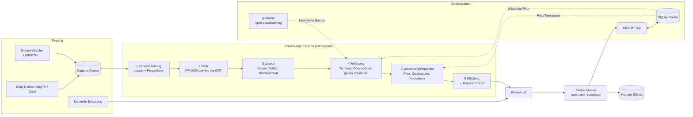

# Systemarchitektur

## 1. Überblick



Leitprinzipien:

1. **UEX-Daten sind Constraint, nicht Dekoration.** Jede Erkennung wird gegen das geschlossene Vokabular (Terminals, Commodities, Statusstufen, Container-Größen) aufgelöst. Freie OCR-Strings erreichen nie die API.
2. **Nichts still raten.** Jede Unsicherheit wird als Warnung mit Grund-Code sichtbar. Das Sende-Gate blockiert Ungeklärtes.
3. **Reine Domänenlogik und I/O sind getrennt.** Pipeline-Stufen sind reine Funktionen auf unveränderlichen Records. Dadurch sind sie mit Golden-Daten testbar, ohne UI und ohne Netzwerk.
4. **Sprachneutraler Schnitt.** Die Modulgrenzen erlauben, einzelne Teile (z. B. den OCR-Kern) später auszutauschen.

## 2. Module (Gradle-Multiprojekt, JPMS-Module)

```
uex-datarunner-client/
├── build-logic/            Convention-Plugins (Java-Toolchain, Error Prone/NullAway, Spotless, Tests)
├── domain/                 Records/Sealed-Types, keine Abhängigkeiten außer JSpecify
├── uex-api/                HTTP-Client, DTOs, Envelope, Fehlercodes, Rate-Limiter
├── refdata/                SQLite-Cache, Refresh-Scheduler, Vokabular-Indizes, Fuzzy-Matcher, global.ini-Parser
├── ocr/                    ONNX-Runtime-Sessions, DB-Detektion, CTC-Erkennung, Bildoperationen, Homographie
├── pipeline/               Locate, Layout, Feldparser, Auflösung, Validierung, Reparatur, Stitching, Konfidenz
├── capture/                Ordner-Watcher, SC-Installationserkennung (Win/Linux/Wine), Clipboard, Dedupe
├── submission/             Report→Payload, Sende-Queue, Cooldown, Historie, data_remove
├── app/                    JavaFX-UI (MVVM), Einstellungen, Secret-Store (FFM), Onboarding, Packaging
└── tools/ocr-eval/         CLI: Golden-Korpus-Auswertung, Crop-Dumps, Digest
```

Abhängigkeiten (nur in Pfeilrichtung):

```
app → submission → uex-api → domain
app → pipeline → ocr → domain
pipeline → refdata → uex-api
app → capture → domain
tools/ocr-eval → pipeline, refdata
```

Package-Root: `space.uexdatarunner.<modul>` (Platzhalter – Projektname und Reverse-Domain sind vom Projektinhaber festzulegen).

## 3. Domänenmodell (Auszug, `domain`)

```java
public enum GameEnvironment { LIVE, PTU, EPTU, HOTFIX, TECH_PREVIEW }

public enum TradeSide { BUY, SELL }                 // Buy-Tab / "Local Market Value"-Tab

public record TerminalId(int value) {}
public record CommodityId(int value) {}

/** UEX-Statusstufe 1..7 (commodities_status), seitenabhängige Bezeichnung. */
public record InventoryStatus(int code) {
    public InventoryStatus { if (code < 1 || code > 7) throw new IllegalArgumentException("status " + code); }
}

/** Ein Feldwert samt Herkunft und Bewertung – Kern des "nichts still raten"-Prinzips. */
public record Field<T>(@Nullable T value, Confidence confidence, List<Finding> findings, @Nullable Region source) {}

public sealed interface Finding permits Finding.Ambiguous, Finding.OutOfTolerance,
        Finding.Repaired, Finding.Inconsistent, Finding.Unreadable, Finding.PartialCard { … }

public record PriceRow(CommodityId commodity, TradeSide side,
                       Field<BigDecimal> pricePerScu, Field<Integer> scu,
                       Field<InventoryStatus> status, Field<Set<Integer>> containerSizes,
                       int screenOrder) {}

public record ReportDraft(Field<TerminalId> terminal, TradeSide side, GameEnvironment env,
                          String gameVersion, List<PriceRow> rows, List<CaptureRef> captures) {}
```

- **Geld:** `BigDecimal`, nie `double`. Seit SC 4.7 zeigt das Spiel ganze aUEC; die API akzeptiert float.
- **Pattern Matching:** Pipeline-Ergebnisse sind `sealed` (`ScanResult.Located | NotLocated | WrongScreen`) und werden mit `switch` und Record-Patterns ausgewertet.

## 4. Erkennungs-Pipeline (`ocr` + `pipeline`)

Details und Herleitung stehen in [07-ocr-konzept.md](07-ocr-konzept.md). Kurzfassung:

| Stufe | Eingabe → Ausgabe | Wichtigste Techniken |
|---|---|---|
| 1 Locate | `BufferedImage` → Panel-Quad(s) | Box-Filter-Downscale; Farb- und Luminanzanker (theme-agnostisch); Text-Anker aus einem Grob-OCR-Pass („SHOP INVENTORY“, „YOUR INVENTORIES“); Homographie auf Normgröße; manueller Fallback |
| 2 OCR | Normbild → `List<TextBox>` (Polygon, Text, Score) | PP-OCRv6 small det (DBNet) + rec (CTC) via ONNX Runtime 1.30.0, volles Wörterbuch |
| 3 Layout | TextBoxen → `List<Card>` + Header | Karten über Rahmen/Abstände und das Label „AVAILABLE CARGO SIZE“; Feldzuordnung relativ zur Karte; Tab-Erkennung über Farbintensität des Tab-Hintergrunds |
| 4 Auflösung | Karten → Commodity-/Terminal-Kandidaten | Normalisierung (Groß-/Kleinschreibung, Leerzeichen, Ligaturen) plus gewichtetes Levenshtein/Jaro-Winkler gegen das Vokabular, Sortiment des Terminals bevorzugt |
| 5 Validierung | Kandidaten → `Field<T>` mit Findings | Zahlparser, UEX-Prior, `data_parameters`-Toleranzen, Confusable-Reparatur, Glyph-Topologie-Veto, Status↔SCU-Konsistenz |
| 6 Stitching | Scans → `ReportDraft` | Gruppierung nach Terminal, Seite und Zeitfenster; Merge über `CommodityId` (dank Auflösung einfacher als in basetool); Randkarten-Regel; Konflikt ⇒ `Ambiguous` |

## 5. Referenzdaten (`refdata`)

- Die Endpoints und TTLs stehen in [06-uex-api.md](06-uex-api.md). Beim Start wird gecacht geladen (sofort nutzbar), dann im Hintergrund aktualisiert.
- **Indizes im Speicher:**
  - Commodity-Namen (EN, lokalisiert, Code)
  - Terminal-Namen, Nicknames und Display-Namen
  - Location-Namen
  - Sortiment pro Terminal
  - Statusstufen pro Seite
- Der **Preis-Prior** wird beim Öffnen bzw. Erkennen eines Terminals nachgeladen (`commodities_prices?id_terminal=`) und gecacht (30 min).
- **Persistenz:** SQLite (`sqlite-jdbc`), Tabellen `ref_*` mit Roh-JSON und extrahierten Indexspalten; Schema-Migrationen versioniert (einfaches eigenes Migrationsskript, kein ORM).

## 6. Übermittlung (`submission`)

- **Payload-Bau:** pro Report eine Liste `prices[]`. Buy-Zeilen enthalten `price_buy`/`scu_buy`/`status_buy`, Sell-Zeilen die `_sell`-Felder. Dazu kommen `container_sizes` und `screenshot` (Base64 ohne `data:`-Präfix), `game_version` und `is_production`.
- **Queue:**
  - Virtual Threads
  - `Semaphore` (Standard 2)
  - Token-Bucket 120/min
  - Retry mit exponentiellem Backoff bei 429/5xx/IO, unter Beachtung von `Retry-After`
- **Cooldown:** Schlüssel ist (Terminal, Commodity, Seite, Umgebung); persistent; die UI zeigt die Restzeit.
- **Historie:** `ids_reports`, Zeitstempel, Payload-Hash, Antwort-Status; Link `https://uexcorp.space/data/info/id/<id>`.

## 7. UI (`app`, JavaFX 27)

- **MVVM:** Views in Java-Code oder FXML; ViewModels mit JavaFX-Properties; Services über Konstruktor-Injektion (kein DI-Framework).
- **Threading:** Pipeline und Netzwerk laufen in einem `ExecutorService` auf Virtual Threads. UI-Updates passieren ausschließlich über `Platform.runLater`. CPU-lastige OCR läuft in einem **begrenzten** Plattform-Thread-Pool (Standard: `min(2, cores/2)`), damit das Spiel nicht ausgebremst wird.
- **Ansichten:**
  1. Eingang/Queue
  2. Report-Editor (Tabelle plus Screenshot-Pane mit Highlight der Quellregion)
  3. Manuelle Erfassung
  4. Historie
  5. Einstellungen (Ordner, Umgebungen, Key, Sprache, Testmodus, Schwellwerte)
  6. Onboarding-Assistent
  7. Diagnose
- **Theming:** eigenes CSS (dunkel/hell), unabhängig vom OS.

## 8. Plattform-Integration

| Thema | Windows | Linux |
|---|---|---|
| Secret-Store | Credential Manager (`CredWriteW`/`CredReadW`) via **FFM-API** | Secret Service (libsecret) via FFM; Fallback-Datei 0600 nach Warnung |
| Truststore | `Windows-ROOT` (SunMSCAPI) zusätzlich zum JDK-Truststore | System-CA über JDK-Standard |
| Pfade | `%APPDATA%\<App>` (Config), `%LOCALAPPDATA%\<App>` (Cache/DB/Logs) | XDG-Verzeichnisse |
| SC-Erkennung | RSI-Launcher-Log, Prozess, Laufwerks-Standardpfade | Wine-/Proton-Prefixe (konfigurierbar; Standardkandidaten siehe Annahme A3) |
| Paket | MSI (jpackage + WiX), ZIP | `.deb` (jpackage), `tar.gz` (App-Image) |

## 9. Sicherheit und Datenschutz

- Secret-Key nur im OS-Keystore; Maskierung in Logs über einen Logback-Filter. Ein Test stellt sicher, dass der Key nie in einer Log-Zeile auftaucht.
- Upload-Screenshot: nur der Shop-Ausschnitt, Kontostand geschwärzt (siehe F30).
- Keine Telemetrie. Netzwerkziele sind ausschließlich UEX und GitHub Releases (Update-Check, abschaltbar).
- Kein Zugriff auf den Spielprozess außer dem optionalen Lesen der Prozessliste zur Pfaderkennung.

## 10. Build und CI

- Gradle 9.8.1 (Kotlin DSL, Version-Catalog `gradle/libs.versions.toml`, Convention-Plugins in `build-logic`), Java-Toolchain 27 via Foojay-Resolver.
- GitHub Actions, Matrix `windows-latest` und `ubuntu-latest`:
  - `./gradlew check` (Spotless, Error Prone/NullAway, Tests)
  - OCR-Eval auf dem öffentlichen (geschwärzten) Korpus
  - `jpackage` pro OS bei Tags
- Releases: Artefakte plus SHA-256-Prüfsummen.
